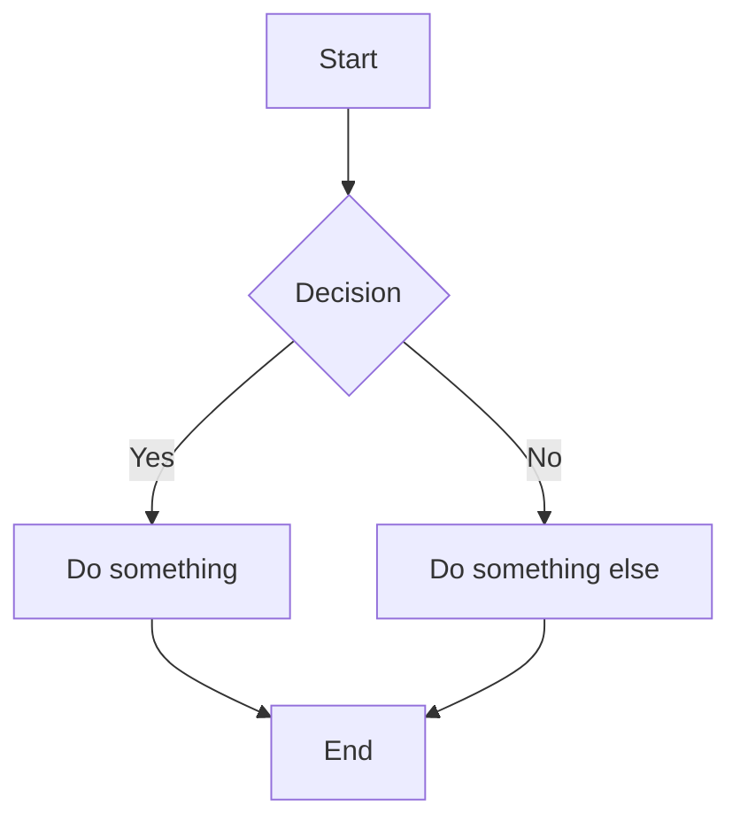
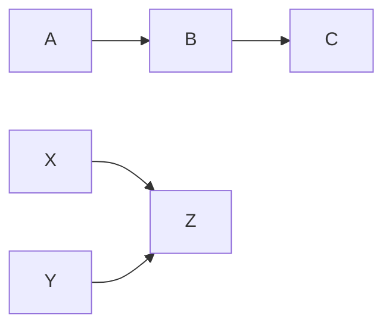

# mmdflux

Parse and render Mermaid flowchart diagrams.

## Installation

```bash
cargo install mmdflux
```

Or build from source:

```bash
git clone https://github.com/yourusername/mmdflux
cd mmdflux
cargo build --release
```

## CLI Usage

```bash
# Parse a Mermaid file
mmdflux diagram.mmd

# Read from stdin
echo -e 'graph LR\nA-->B' | mmdflux

# Multi-line input with heredoc
mmdflux <<EOF
graph TD
    A --> B
    B --> C
EOF

# Write to a file
mmdflux diagram.mmd -o output.txt

# Debug mode: show parsed AST and graph structure
mmdflux --debug diagram.mmd
```

## Example

Input (`diagram.mmd`):



Output:

```
Parsed flowchart: 5 nodes, 5 edges (direction: TopDown)
```

Debug output (`--debug`):

```
Direction: TopDown
Nodes (5):
  A [label="Start", shape=Rectangle]
  B [label="Decision", shape=Diamond]
  C [label="Do something", shape=Rectangle]
  D [label="Do something else", shape=Rectangle]
  E [label="End", shape=Rectangle]
Edges (5):
  A --> B [Solid, Normal]
  B --|Yes|--> C [Solid, Normal]
  B --|No|--> D [Solid, Normal]
  C --> E [Solid, Normal]
  D --> E [Solid, Normal]
```

## Supported Syntax

### Directions

- `TD` / `TB` - Top to Bottom
- `BT` - Bottom to Top
- `LR` - Left to Right
- `RL` - Right to Left

### Node Shapes

| Syntax | Shape |
|--------|-------|
| `A` | Rectangle (default) |
| `A[text]` | Rectangle with label |
| `A(text)` | Rounded rectangle |
| `A{text}` | Diamond |

### Edge Types

| Syntax | Description |
|--------|-------------|
| `-->` | Solid arrow |
| `-->\|label\|` | Solid arrow with label |
| `---` | Open line (no arrow) |
| `-.->` | Dotted arrow |
| `==>` | Thick arrow |

### Chains and Groups



### Comments

Lines starting with `%%` are treated as comments.

## Library Usage

```rust
use mmdflux::{parse_flowchart, build_diagram};

fn main() {
    let input = r#"graph LR
A[Hello] --> B[World]
"#;

    // Parse Mermaid syntax into AST
    let flowchart = parse_flowchart(input).unwrap();

    // Build graph structure
    let diagram = build_diagram(&flowchart);

    println!("Direction: {:?}", diagram.direction);
    println!("Nodes: {}", diagram.nodes.len());
    println!("Edges: {}", diagram.edges.len());

    // Access nodes by ID
    if let Some(node) = diagram.nodes.get("A") {
        println!("Node A: {} ({:?})", node.label, node.shape);
    }

    // Iterate edges
    for edge in &diagram.edges {
        println!("{} -> {}", edge.from, edge.to);
    }
}
```

### Types

```rust
use mmdflux::{Diagram, Direction, Node, Shape, Edge, Stroke, Arrow};

// Direction: TopDown, BottomTop, LeftRight, RightLeft
// Shape: Rectangle, Round, Diamond
// Stroke: Solid, Dotted, Thick
// Arrow: Normal, None
```

## Roadmap

- [x] Flowchart parsing (`graph` / `flowchart`)
- [ ] ASCII rendering
- [ ] Sequence diagrams
- [ ] Class diagrams
- [ ] State diagrams
- [ ] Entity Relationship diagrams

## License

MIT
