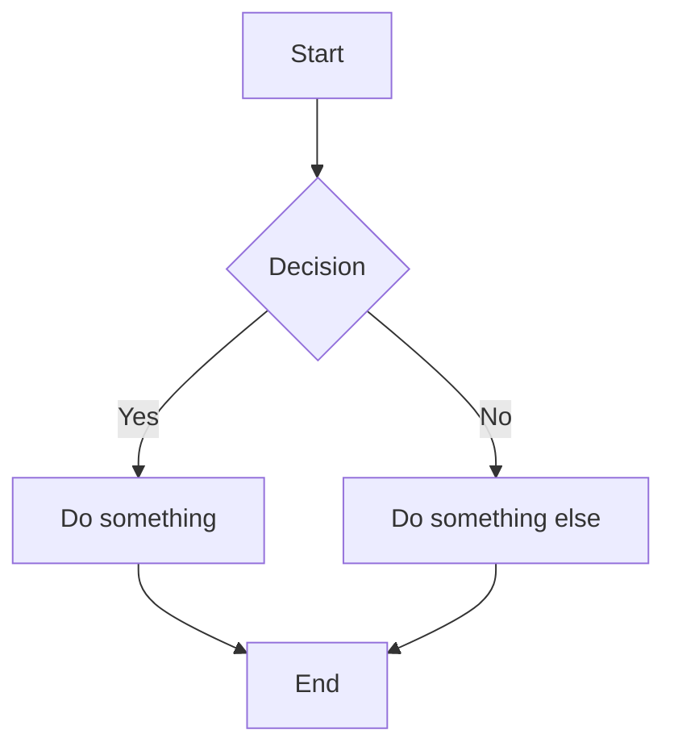

# mmdflux

Convert Mermaid diagrams to ASCII art.

## Installation

```bash
cargo install mmdflux
```

Or build from source:

```bash
git clone https://github.com/yourusername/mmdflux
cd mmdflux
cargo build --release
```

## CLI Usage

```bash
# Convert a Mermaid file to ASCII
mmdflux diagram.mmd

# Read from stdin
echo 'graph LR; A-->B' | mmdflux

# Multi-line input with heredoc
mmdflux <<EOF
graph TD
    A --> B
    B --> C
EOF

# Write to a file
mmdflux diagram.mmd -o output.txt
```

## Example

Input (`diagram.mmd`):



Output:

```
┌───────┐
│ Start │
└───┬───┘
    │
    ▼
┌──────────┐
│ Decision │
└────┬─────┘
     │
   ┌─┴─┐
   │   │
Yes│   │No
   │   │
   ▼   ▼
┌──────────────┐  ┌───────────────────┐
│ Do something │  │ Do something else │
└──────┬───────┘  └─────────┬─────────┘
       │                    │
       └────────┬───────────┘
                │
                ▼
           ┌─────┐
           │ End │
           └─────┘
```

## Library Usage

```rust
use mmdflux::render;

fn main() {
    let diagram = r#"
        graph LR
            A[Hello] --> B[World]
    "#;

    let ascii = render(diagram).unwrap();
    println!("{}", ascii);
}
```

## Supported Diagram Types

- [ ] Flowcharts (`graph` / `flowchart`)
- [ ] Sequence diagrams
- [ ] Class diagrams
- [ ] State diagrams
- [ ] Entity Relationship diagrams

## License

MIT
