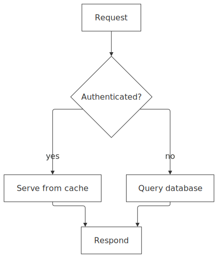

# mmdflux

Render diagrams as Unicode text, ASCII text, SVG, or JSON. Supports Mermaid syntax.

`mmdflux` is built for diagram-as-code pipelines: fast rendering, terminal-friendly output, linting, and machine-readable graph data for tooling and agents.

[Playground](https://kevinswiber.github.io/mmdflux/) • [Releases](https://github.com/kevinswiber/mmdflux/releases) • [MMDS Spec](docs/mmds.md)

## At a glance

One Mermaid source, multiple outputs: terminal text, SVG, and machine-readable JSON.

**Mermaid source** ([`docs/assets/readme/at-a-glance.mmd`](docs/assets/readme/at-a-glance.mmd))

```
graph TD
    A[Request] --> B{Authenticated?}
    B -->|yes| C[Serve from cache]
    B -->|no| D[Query database]
    C --> E[Respond]
    D --> E
```

**SVG output** (`mmdflux --format svg --layout-engine flux-layered --edge-preset smoothstep ...`)

<picture>
  <source media="(prefers-color-scheme: dark)" srcset="docs/assets/readme/at-a-glance-dark.svg">
  <source media="(prefers-color-scheme: light)" srcset="docs/assets/readme/at-a-glance-light.svg">
  
</picture>

<details>
<summary>Text output (<code>mmdflux --format text ...</code>)</summary>

```text
                 ┌─────────┐
                 │ Request │
                 └─────────┘
                      │
                      │
                      │
                      │
                      ▼
             ┌────────────────┐
             < Authenticated? >
             └────────────────┘
          ┌───┘              └────┐
          │                       │
         yes                     no
          │                       │
          ▼                       ▼
┌──────────────────┐       ┌────────────────┐
│ Serve from cache │       │ Query database │
└──────────────────┘       └────────────────┘
          │                       │
          │                       │
          │                       │
          └───────┐       ┌───────┘
                  ▼       ▼
                 ┌─────────┐
                 │ Respond │
                 └─────────┘
```

</details>

**MMDS JSON output**: [`docs/assets/readme/at-a-glance.mmds.json`](docs/assets/readme/at-a-glance.mmds.json)

## Why mmdflux

- Terminal-native output that still preserves structure and readability
- SVG and MMDS JSON output for web tooling, automation, and data pipelines
- Native `flux-layered` engine with deterministic routing policies
- Compatibility `mermaid-layered` engine when Mermaid-style behavior is preferred

## Flux Layered (Native Engine)

`flux-layered` is the default graph engine for flowchart/class SVG and MMDS output.
It keeps the layered (Sugiyama) foundation but adds a native routing contract and
policy-driven geometry decisions that are hard to get from layout-only engines.

### What makes it distinct

- Layered layout + routing are treated as one solve contract (not disconnected phases)
- Rank-annotated waypoint metadata is preserved for downstream routing decisions
- Float-space orthogonal routing with deterministic fan-in/fan-out overflow policies
- Explicit backward-edge channel/face precedence rules
- Per-node effective direction in subgraphs and cross-boundary routing behavior
- Shape-aware attachment and clipping for non-rectangular nodes (for example, diamond/hexagon)
- Self-edge loops are emitted as explicit multi-point orthogonal paths
- The same graph model feeds text, SVG, and MMDS pipelines

### Engine snapshot

| Capability           | `flux-layered`                             | `mermaid-layered`                    |
| -------------------- | ------------------------------------------ | ------------------------------------ |
| Route ownership      | Native                                     | Hint-driven                          |
| Routing styles       | `orthogonal`, `polyline`                   | `polyline`                           |
| Default SVG behavior | Orthogonal topology + smooth interpolation | Mermaid-compatible polyline defaults |
| Subgraph support     | Yes                                        | Yes                                  |
| Best fit             | Deterministic routed SVG/MMDS output       | Mermaid-style compatibility output   |

## Install

### Homebrew (recommended)

```bash
brew tap kevinswiber/mmdflux
brew install mmdflux
```

### Cargo

```bash
cargo install mmdflux
```

### Prebuilt binaries

Download platform binaries from [GitHub Releases](https://github.com/kevinswiber/mmdflux/releases).

## Quick Start

```bash
# Render a Mermaid file to text (default format)
mmdflux diagram.mmd

# Read Mermaid from stdin
printf 'graph LR\nA-->B\n' | mmdflux

# Text output (default)
mmdflux --format text diagram.mmd

# SVG output (flowchart/class)
mmdflux --format svg diagram.mmd -o diagram.svg

# Native flux layered (default) SVG with explicit style preset
mmdflux --format svg --layout-engine flux-layered --edge-preset smoothstep diagram.mmd -o diagram.svg

# MMDS JSON output with routed geometry detail
mmdflux --format mmds --layout-engine flux-layered --geometry-level routed --path-detail compact diagram.mmd

# Lint mode (validate input and print diagnostics)
mmdflux --lint diagram.mmd
```

## What It Supports

- Flowchart rendering in Unicode/ASCII/SVG/MMDS
- Class diagram rendering in Unicode/ASCII/SVG/MMDS
- Mermaid-to-MMDS and MMDS-to-Mermaid conversion
- Layout directions: `TD`, `BT`, `LR`, `RL`
- Edge styles: solid, dotted, thick, invisible, cross-arrow, circle-arrow
- Engine selection: `flux-layered`, `mermaid-layered` (ELK engines available when built with `engine-elk`)

## Documentation

- [Gallery](docs/gallery.md)
- [MMDS specification](docs/mmds.md)
- [Edge routing design](docs/edge-routing-heuristics.md)

## License

MIT
