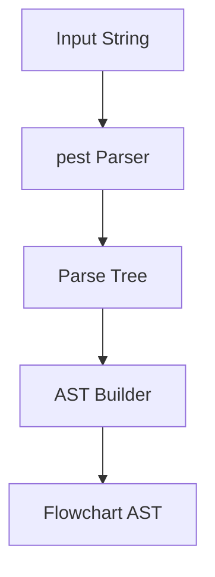
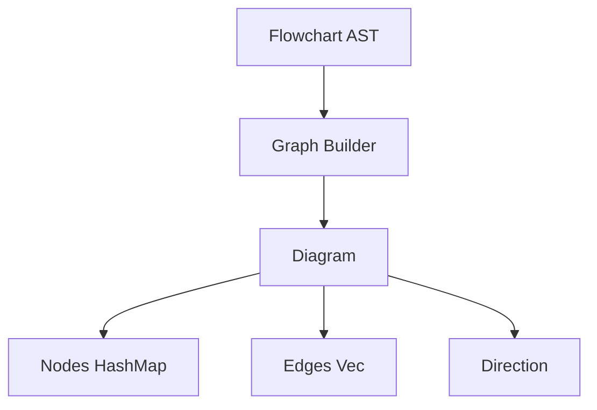
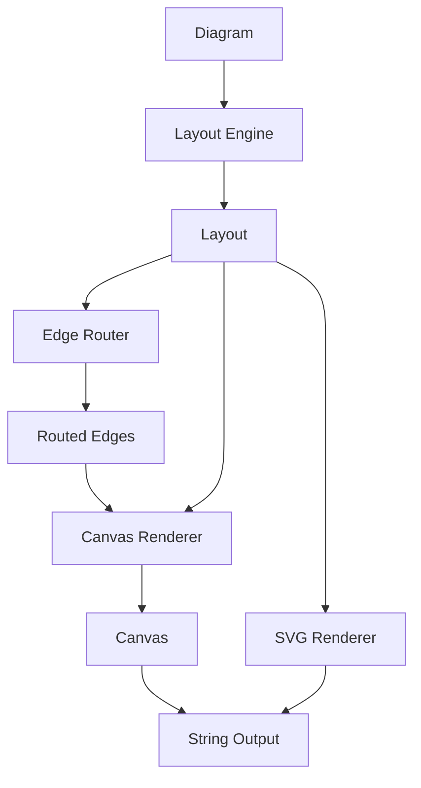
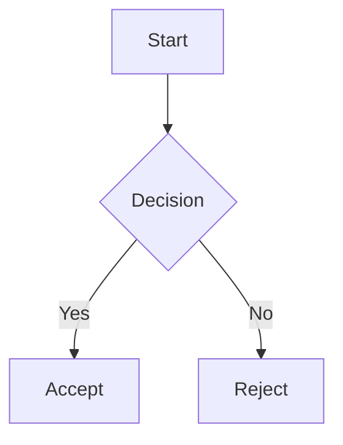

# Architecture

This document describes the internal architecture of mmdflux for developers who want to understand, modify, or extend the codebase.

## Overview

mmdflux converts Mermaid flowchart syntax into ASCII art through a three-stage pipeline:


Each stage has a clear responsibility and well-defined data structures that flow between them.

## MMDS Governance

MMDS uses a strict-core / permissive-extension contract:

- Core fields are validated strictly (version, enums, references, structural integrity).
- Output-specific controls are declared via top-level `profiles` and namespaced `extensions`.
- Unknown profile names and unknown extension namespaces are tolerated for forward compatibility.
- Unsupported MMDS core versions remain hard errors.

Initial profile set:

- `mmds-core-v1`
- `mmdflux-svg-v1`
- `mmdflux-text-v1`

Extension namespace keys follow a versioned pattern such as `org.mmdflux.render.svg.v1`.

## Pipeline Stages

### Stage 1: Parsing

**Location:** `src/parser/`

The parser converts Mermaid text into an Abstract Syntax Tree (AST). It uses [pest](https://pest.rs/), a PEG (Parsing Expression Grammar) parser generator.



**Key files:**
- `grammar.pest` - PEG grammar rules defining valid Mermaid syntax
- `ast.rs` - AST type definitions
- `flowchart.rs` - Transforms pest parse tree into our AST

**AST Types:**

```
Flowchart
├── direction: Direction (TD, BT, LR, RL)
└── statements: Vec<Statement>
    ├── Vertex(Vertex)
    │   ├── id: String
    │   └── shape: Option<ShapeSpec>
    └── Edge(EdgeSpec)
        ├── left: Vec<Vertex>
        ├── right: Vec<Vertex>
        └── connector: ConnectorSpec
```

The grammar supports:
- Header declarations (`graph TD`, `flowchart LR`)
- Node shapes: `[rect]`, `(round)`, `{diamond}`
- Edge types: `-->`, `-.->`, `==>`, `---`
- Edge labels: `-->|label|`
- Chains: `A --> B --> C`
- Groups: `A & B --> C`
- Comments: `%% comment`

### Stage 2: Graph Building

**Location:** `src/graph/`

The graph builder transforms the AST into a normalized graph structure suitable for layout computation.



**Key files:**
- `diagram.rs` - `Diagram` container struct
- `node.rs` - `Node` with id, label, and shape
- `edge.rs` - `Edge` with from/to, stroke, arrow, label
- `builder.rs` - `build_diagram()` conversion logic

**Responsibilities:**
- Deduplicate nodes (same ID referenced multiple times)
- Merge node attributes (label/shape from different statements)
- Convert AST types to graph types
- Expand chain syntax (`A --> B --> C` becomes two edges)
- Expand ampersand groups (`A & B --> C` becomes two edges)

### Stage 3: Rendering

**Location:** `src/render/`

Rendering is the most complex stage, subdivided into layout, routing, and drawing.



Text rendering uses the ASCII canvas pipeline. SVG rendering bypasses the router
and canvas entirely, consuming dagre's floating-point `LayoutResult` directly in
`render/svg.rs` and emitting SVG elements with presentation attributes.

#### Layout Engine (`layout.rs`)

Computes where each node should be positioned on the canvas.

**Algorithm:**
1. **Topological Sort** - Assign nodes to layers based on dependencies
2. **Grid Positioning** - Place nodes within each layer
3. **Dimension Calculation** - Compute node sizes based on labels
4. **Coordinate Mapping** - Convert grid positions to canvas coordinates
5. **Backward Edge Detection** - Identify cycles and allocate corridor space

```
Layout
├── grid_positions: HashMap<String, GridPos>
├── draw_positions: HashMap<String, (x, y)>
├── node_bounds: HashMap<String, NodeBounds>
├── width, height: canvas dimensions
├── backward_corridors: count of cycle edges
└── backward_edge_lanes: lane assignments for cycles
```

**Direction handling:**
- TD/BT: Layers are rows, nodes flow vertically
- LR/RL: Layers are columns, nodes flow horizontally
- BT/RL: Coordinates are reversed after computation

**Cycle handling:**
When a cycle is detected (edge goes "backward" against flow direction), the layout allocates corridor space on the diagram perimeter for routing these edges around.

#### Edge Router (`router.rs`)

Computes paths for edges, avoiding node boundaries.

**Forward edges** follow the natural flow direction:
- TD: Exit bottom of source, enter top of target
- LR: Exit right of source, enter left of target

**Backward edges** (cycles) route around the perimeter:
- TD/BT: Exit right, travel in corridor, enter right
- LR/RL: Exit bottom, travel in corridor, enter bottom

```
RoutedEdge
├── edge: Edge
├── start: Point (attachment on source)
├── end: Point (attachment on target)
├── segments: Vec<Segment>
│   ├── Vertical { x, y_start, y_end }
│   └── Horizontal { y, x_start, x_end }
└── entry_direction: AttachDirection
```

**Path computation:**
- Straight paths when nodes are aligned
- L-shaped or Z-shaped paths when offset
- Multiple lanes for multiple backward edges

#### Canvas Renderer

**Key files:**
- `canvas.rs` - 2D character grid
- `shape.rs` - Node shape drawing
- `edge.rs` - Edge and arrow drawing
- `chars.rs` - Unicode/ASCII character sets

**Drawing order:**
1. Create canvas with computed dimensions
2. Draw all nodes (shapes with labels)
3. Draw all edges (lines with arrows)
4. Draw edge labels

**Character sets:**
```
Unicode: ┌ ┐ └ ┘ │ ─ ┬ ┴ ├ ┤ ┼ ► ▼ ◄ ▲
ASCII:   + + + + | - + + + + + > v < ^
```

## Data Flow Example

Given input:


**After parsing (AST):**
```
Flowchart {
    direction: TopDown,
    statements: [
        Edge { left: [A[Start]], right: [B{Decision}], connector: Arrow },
        Edge { left: [B], right: [C[Accept]], connector: ArrowWithLabel("Yes") },
        Edge { left: [B], right: [D[Reject]], connector: ArrowWithLabel("No") },
    ]
}
```

**After graph building (Diagram):**
```
Diagram {
    direction: TopDown,
    nodes: {
        "A": Node { label: "Start", shape: Rectangle },
        "B": Node { label: "Decision", shape: Diamond },
        "C": Node { label: "Accept", shape: Rectangle },
        "D": Node { label: "Reject", shape: Rectangle },
    },
    edges: [
        Edge { from: "A", to: "B", stroke: Solid, arrow: Normal },
        Edge { from: "B", to: "C", label: "Yes", ... },
        Edge { from: "B", to: "D", label: "No", ... },
    ]
}
```

**After layout:**
```
Layer 0: [A]
Layer 1: [B]
Layer 2: [C, D]

Grid positions:
  A: (layer=0, pos=0)
  B: (layer=1, pos=0)
  C: (layer=2, pos=0)
  D: (layer=2, pos=1)
```

**After routing:**
```
A→B: Vertical line from A.bottom to B.top
B→C: Z-path from B.bottom to C.top (with horizontal jog)
B→D: Z-path from B.bottom to D.top (with horizontal jog)
```

## Key Design Decisions

### PEG Parser (pest)

We chose pest for parsing because:
- Declarative grammar is easy to read and modify
- Generates fast, zero-copy parsers
- Good error messages for malformed input
- Rust-native with derive macros

### Topological Sort for Layout

Nodes are assigned to layers using a modified topological sort:
- Nodes with no incoming edges start in layer 0
- Each subsequent layer contains nodes whose predecessors are all in earlier layers
- Cycles are broken by selecting the node with minimum in-degree

This produces natural top-to-bottom (or left-to-right) flow.

### Corridor-Based Backward Edge Routing

Backward edges (cycles) are routed in corridors outside the main diagram area:
- Avoids crossing through intermediate nodes
- Multiple backward edges get separate lanes
- Lane assignment is deterministic (sorted by source/target positions)

### Separation of Concerns

The three-stage pipeline allows:
- Parser can be reused for other output formats
- Graph structure is independent of rendering
- Layout algorithm can be improved without touching parsing
- Different character sets (Unicode/ASCII) without changing logic

## Extending mmdflux

### Adding a New Node Shape

1. Add variant to `ShapeSpec` in `parser/ast.rs`
2. Add grammar rule in `grammar.pest`
3. Add variant to `Shape` in `graph/node.rs`
4. Map AST shape to graph shape in `graph/builder.rs`
5. Implement drawing in `render/shape.rs`

### Adding a New Edge Style

1. Add grammar rules in `grammar.pest`
2. Add variant to `ConnectorSpec` in `parser/ast.rs`
3. Map to `Stroke`/`Arrow` in `graph/builder.rs`
4. Add drawing characters in `render/chars.rs` if needed

### Adding a New Diagram Type

The current architecture is flowchart-specific. Adding sequence diagrams, class diagrams, etc. would require:
1. New grammar rules (or separate grammar file)
2. New AST types
3. New graph structures (may differ significantly)
4. New layout algorithm (sequence diagrams have different constraints)
5. New rendering logic

Consider creating parallel module trees (`parser/sequence/`, `graph/sequence/`, etc.) rather than overloading existing structures.
