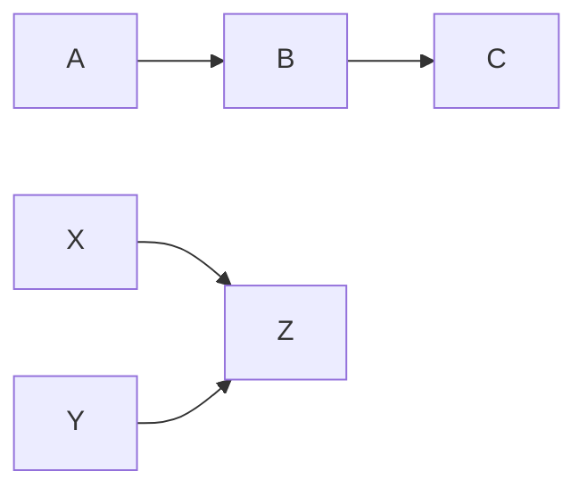
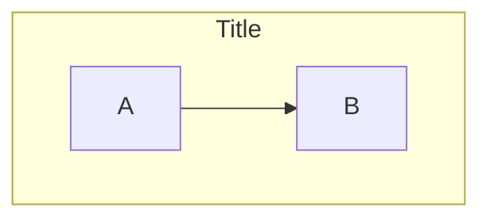

# CLI Reference

## Basic Usage

```bash
# Parse a Mermaid file
mmdflux diagram.mmd

# Read from stdin
printf 'graph LR\nA-->B\n' | mmdflux

# Multi-line input with heredoc
mmdflux <<EOF2
graph TD
    A --> B
    B --> C
EOF2

# Write output to a file
mmdflux diagram.mmd -o output.txt

# Detect diagram type while rendering
mmdflux --debug diagram.mmd

# Validate diagram input and emit diagnostics
mmdflux --lint diagram.mmd

# Show node IDs alongside labels
mmdflux --show-ids diagram.mmd
```

## Output Formats

```bash
# Unicode text (default)
mmdflux diagram.mmd

# ASCII
mmdflux --format ascii diagram.mmd

# SVG (flowchart only)
mmdflux --format svg diagram.mmd -o diagram.svg

# MMDS JSON
mmdflux --format mmds diagram.mmd

# Mermaid (from MMDS input)
mmdflux --format mermaid diagram.mmds.json
```

Note: SVG output is currently supported for flowcharts. For MMDS geometry-level constraints, see [mmds.md](mmds.md).

## Supported Mermaid Syntax (Flowchart)

### Directions

- `TD` / `TB` - Top to Bottom
- `BT` - Bottom to Top
- `LR` - Left to Right
- `RL` - Right to Left

### Node Shapes

| Syntax          | Shape                   |
| --------------- | ----------------------- |
| `A`             | Rectangle (default)     |
| `A[text]`       | Rectangle with label    |
| `A(text)`       | Rounded rectangle       |
| `A([text])`     | Stadium                 |
| `A[[text]]`     | Subroutine              |
| `A[(text)]`     | Cylinder                |
| `A{text}`       | Diamond                 |
| `A{{text}}`     | Hexagon                 |
| `A((text))`     | Circle                  |
| `A(((text)))`   | Double circle           |
| `A>text]`       | Asymmetric (flag)       |
| `A[/text\\]`   | Trapezoid               |
| `A[\\text/]`   | Inverse trapezoid       |
| `@{shape: ...}` | Extended shape notation |

### Edge Types

| Syntax         | Description             |
| -------------- | ----------------------- |
| `-->`          | Solid arrow             |
| `-->\|label\|` | Solid arrow with label  |
| `---`          | Open line (no arrow)    |
| `-.->`         | Dotted arrow            |
| `==>`          | Thick arrow             |
| `~~~`          | Invisible (layout only) |
| `--x`          | Cross arrow             |
| `--o`          | Circle arrow            |
| `<-->`         | Bidirectional arrow     |

### Chains and Groups



### Subgraphs



Lines starting with `%%` are treated as comments.

## MMDS Output

MMDS (Machine-Mediated Diagram Specification) is the structured JSON format for tool integrations.

```bash
# Layout level (default): node geometry + edge topology
mmdflux --format mmds diagram.mmd

# Routed level: includes edge paths, bounds, routing metadata
mmdflux --format mmds --geometry-level routed diagram.mmd

# Reduce edge path detail for compact payloads
mmdflux --format mmds --geometry-level routed --path-detail simplified diagram.mmd
mmdflux --format mmds --geometry-level routed --path-detail endpoints diagram.mmd
```

`--path-detail` values:

| Value        | Waypoints kept                 |
| ------------ | ------------------------------ |
| `full`       | All routed waypoints (default) |
| `simplified` | Start, midpoint, and end only  |
| `endpoints`  | Start and end only             |

For the full spec, validation contract, and capability matrix, see [mmds.md](mmds.md).

## MMDS to Mermaid Generation

### CLI

```bash
# Convert MMDS file to Mermaid
mmdflux --format mermaid diagram.mmds.json

# Roundtrip: Mermaid -> MMDS -> Mermaid
mmdflux --format mmds diagram.mmd | mmdflux --format mermaid
```

### Library

```rust
use mmdflux::generate_mermaid_from_mmds_str;

let mmds_json = std::fs::read_to_string("diagram.mmds.json").unwrap();
let mermaid = generate_mermaid_from_mmds_str(&mmds_json).unwrap();
println!("{mermaid}");
```
