# mmdflux gallery

_Generated from commit `a361584` — 70 fixtures_

This gallery is generated from test fixtures in `tests/fixtures`,
text snapshots in `tests/snapshots`, and SVG snapshots in `tests/svg-snapshots`.

## ampersand

`tests/fixtures/ampersand.mmd`

**Text**

```text
┌──────────┐    ┌──────────┐
│ Source 1 │    │ Source 2 │
└──────────┘    └──────────┘
      │              │
      └───┐     ┌────┘
          ▼     ▼
         ┌───────┐
         │ Merge │
         └───────┘
      ┌───┘     └────┐
      │              │
      ▼              ▼
┌──────────┐    ┌──────────┐
│ Output 1 │    │ Output 2 │
└──────────┘    └──────────┘
```

**SVG**


<details>
<summary>Mermaid source</summary>

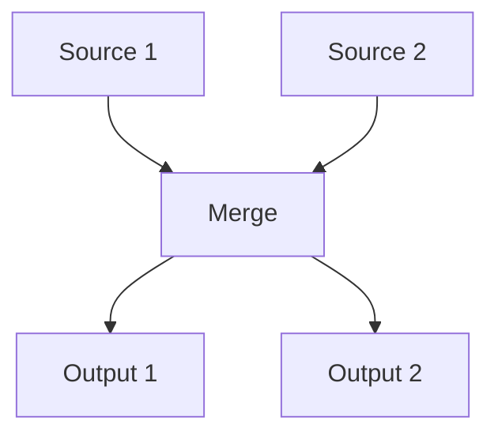

</details>

## backward_in_subgraph

`tests/fixtures/backward_in_subgraph.mmd`

**Text**

```text
┌──── Group ────┐
│   ┌──────┐    │
│   │ Node │    │
│   └──────┘    │
│    └┐   ▲     │
│    ┌┘   └┐    │
│    ▼     │    │
│   ┌───────┐   │
│   │ Node2 │   │
│   └───────┘   │
└───────────────┘
```

**SVG**

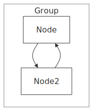

<details>
<summary>Mermaid source</summary>

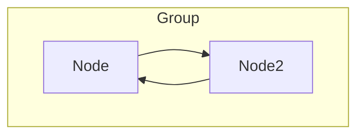

</details>

## bidirectional_arrows

`tests/fixtures/bidirectional_arrows.mmd`

**Text**

```text
┌───┐
│ A │
└───┘
  ▲
  │
  ▼
┌───┐
│ B │
└───┘
  ▲
  ┆
  ▼
┌───┐
│ C │
└───┘
  ▲
  ┃
  ▼
┌───┐
│ D │
└───┘
```

**SVG**

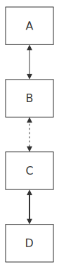

<details>
<summary>Mermaid source</summary>

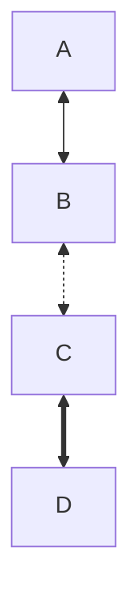

</details>

## bidirectional

`tests/fixtures/bidirectional.mmd`

**Text**

```text
┌───┐
│ A │
└───┘
  ▲
  │
  ▼
┌───┐
│ B │
└───┘
  ▲
  ┆
  ▼
┌───┐
│ C │
└───┘
  ▲
  ┃
  ▼
┌───┐
│ D │
└───┘
```

**SVG**


<details>
<summary>Mermaid source</summary>


</details>

## bottom_top

`tests/fixtures/bottom_top.mmd`

**Text**

```text
   ┌──────┐
   │ Roof │
   └──────┘
       ▲
       │
       │
 ┌───────────┐
 │ Structure │
 └───────────┘
       ▲
       │
       │
┌────────────┐
│ Foundation │
└────────────┘
```

**SVG**


<details>
<summary>Mermaid source</summary>

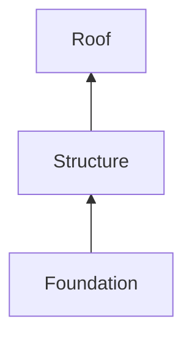

</details>

## chain

`tests/fixtures/chain.mmd`

**Text**

```text
┌────────┐
│ Step 1 │
└────────┘
     │
     │
     ▼
┌────────┐
│ Step 2 │
└────────┘
     │
     │
     ▼
┌────────┐
│ Step 3 │
└────────┘
     │
     │
     ▼
┌────────┐
│ Step 4 │
└────────┘
```

**SVG**

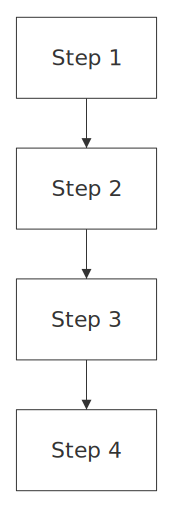

<details>
<summary>Mermaid source</summary>

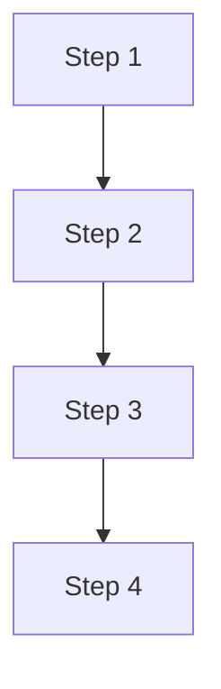

</details>

## ci_pipeline

`tests/fixtures/ci_pipeline.mmd`

**Text**

```text
                                                                                                                                               ┌─────────────┐
                                                                                                                          ┌──────staging─┐     │ Staging Env │
                                                                                                                          │              └────►└─────────────┘
┌──────────┐                 ┌───────┐                ┌───────────┐              ┌────────────┐                ┌─────────┐┘
│ Git Push │────────────────►│ Build │───────────────►│ Run Tests │─────────────►│ Lint Check │───────────────►< Deploy? >
└──────────┘                 └───────┘                └───────────┘              └────────────┘                └─────────┘┐
                                                                                                                          │             ┌────►┌────────────┐
                                                                                                                          └────production     │ Production │
                                                                                                                                              └────────────┘
```

**SVG**

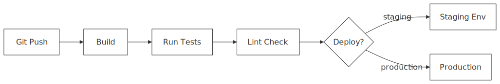

<details>
<summary>Mermaid source</summary>

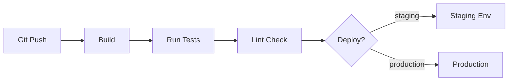

</details>

## compat_class_annotation

`tests/fixtures/compat_class_annotation.mmd`

**Text**

```text
     ┌───────┐
     │ Start │
     └───────┘
         │
         │
         │
         │
         ▼
   ┌──────────┐
   < Decision >
   └──────────┘
  ┌─┘        └──┐
  │             │
 Yes           No
  │             │
  ▼             ▼
┌───┐         ┌───┐
│ C │         │ D │
└───┘         └───┘
```

**SVG**

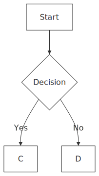

<details>
<summary>Mermaid source</summary>

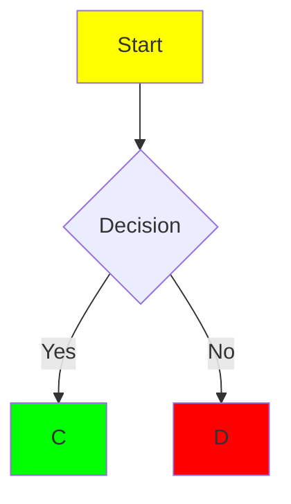

</details>

## compat_directive

`tests/fixtures/compat_directive.mmd`

**Text**

```text
         ┌───────┐
         │ Start │
         └───────┘
             │
             │
             │
             │
             ▼
       ┌──────────┐
       < Decision >
       └──────────┘
     ┌──┘        └───┐
     │               │
    Yes             No
     │               │
     ▼               ▼
┌─────────┐       ┌─────┐
│ Process │       │ End │
└─────────┘       └─────┘
```

**SVG**

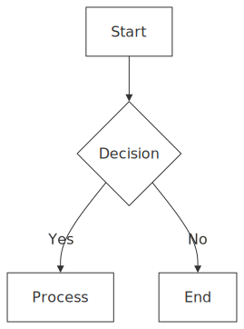

<details>
<summary>Mermaid source</summary>

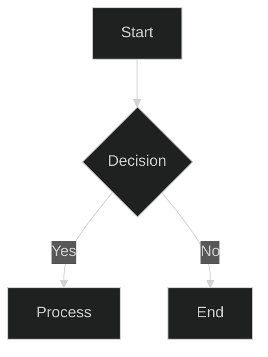

</details>

## compat_frontmatter

`tests/fixtures/compat_frontmatter.mmd`

**Text**

```text
┌───┐
│ A │
└───┘
  │
  │
  ▼
┌───┐
│ B │
└───┘
  │
  │
  ▼
┌───┐
│ C │
└───┘
```

**SVG**


<details>
<summary>Mermaid source</summary>

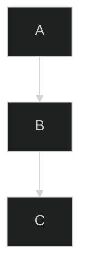

</details>

## compat_hyphenated_ids

`tests/fixtures/compat_hyphenated_ids.mmd`

**Text**

```text
  ┌───────┐
  │ Start │
  └───────┘
      │
      │
      ▼
┌───────────┐
│ Process A │
└───────────┘
      │
      │
      ▼
  ┌───────┐
  < Check >
  └───────┘
      │
     ok
      ▼
  ┌──────┐
  │ Done │
  └──────┘
```

**SVG**

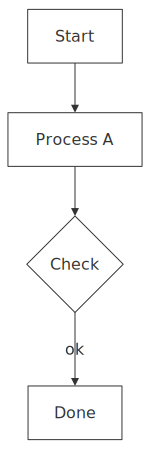

<details>
<summary>Mermaid source</summary>

```mermaid
graph TD
    start-node[Start] --> process-1[Process A]
    process-1 --> decision-point{Check}
    decision-point -->|ok| end-node[Done]

```

</details>

## compat_invisible_edge

`tests/fixtures/compat_invisible_edge.mmd`

**Text**

```text
   ┌───┐
   │ A │
   └───┘
  ┌─┘ └─┐
  │     │
  ▼     │
┌───┐   │
│ B │   │
└───┘   │
        │
      ┌─┘
      ▼
   ┌───┐
   │ C │
   └───┘
```

**SVG**

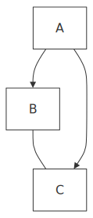

<details>
<summary>Mermaid source</summary>

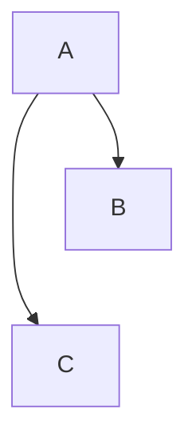

</details>

## compat_kitchen_sink

`tests/fixtures/compat_kitchen_sink.mmd`

**Text**

```text
             ┌───────┐
             │ Start │
             └───────┘
                 │
                 │
                 │
                 │
                 ▼
          ┌─────────────┐
          < Check Input >
          └─────────────┘
      ┌────┘           └────┐
      │                     │
    valid                invalid
      │                     │
      ▼                     ▼
┌───────────┐           ┌───────┐
│ process-A │           │ Error │
└───────────┘           └───────┘
      │                     │
      │                     │
      │                     │
      └───────┐    ┌────────┘
              ▼    ▼
             ┌──────┐
             │ Done │
             └──────┘
```

**SVG**


<details>
<summary>Mermaid source</summary>

```mermaid
---
config:
  theme: default
---
%%{init: {"flowchart": {"curve": "basis"}}}%%
graph TD
    start-node[Start] --> check-1{Check Input}
    check-1 -->|valid| process-A:::success
    check-1 -->|invalid| error-1[Error]:::error
    process-A --> end-node[Done]
    error-1 --> end-node
    style start-node fill:#f9f
    classDef success fill:#0f0
    classDef error fill:#f00

```

</details>

## compat_no_direction

`tests/fixtures/compat_no_direction.mmd`

**Text**

```text
┌───────┐
│ Start │
└───────┘
    │
    │
    ▼
 ┌─────┐
 │ End │
 └─────┘
```

**SVG**


<details>
<summary>Mermaid source</summary>

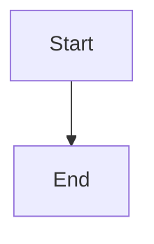

</details>

## compat_numeric_ids

`tests/fixtures/compat_numeric_ids.mmd`

**Text**

```text
┌───────┐    ┌────────┐     ┌───────┐
│ First │───►│ Second │────►│ Third │
└───────┘    └────────┘     └───────┘
```

**SVG**


<details>
<summary>Mermaid source</summary>


</details>

## complex

`tests/fixtures/complex.mmd`

**Text**

```text
          ┌───────┐
          │ Input │
          └───────┘
      ┌────┘     ▲
      │          └────┐
      │               │
      │               │
      ▼               │
┌──────────┐          │
< Validate >          │
└──────────┘          │
 └────┐   └───────────┼───────────────────────────────┐
      │               │                               │
    valid            yes                           invalid
      │               │                               │
      ▼               │                               ▼
 ┌─────────┐          │                       ╭───────────────╮
 │ Process │          │                       │ Error Handler │
 └─────────┘          │                       ╰───────────────╯
      │               │                   ┌┄┄┄┄┘             ┗━━━━┓
      │               │                   ┆                       ┃
      │               │                   ┆                       ┃
      └─┐             │                   ┆                       ┃
        ▼          ┌──┘                   ▼                       ▼
       ┌────────────┐               ┌───────────┐           ┌──────────────┐
       < More Data? >               │ Log Error │           │ Notify Admin │
       └────────────┘               └───────────┘           └──────────────┘
              │                           │                       │
              │                           │                       │
              │                           │                       │
              │                           └───────┐       ┌───────┘
              │                                   ▼       ▼
             no                                  ┌─────────┐
              │                                  │ Cleanup │
              │                                  └─────────┘
              │                                       │
              │                                       │
              │                                       │
              └───────────────────┐      ┌────────────┘
                                  ▼      ▼
                                 ┌────────┐
                                 │ Output │
                                 └────────┘
```

**SVG**

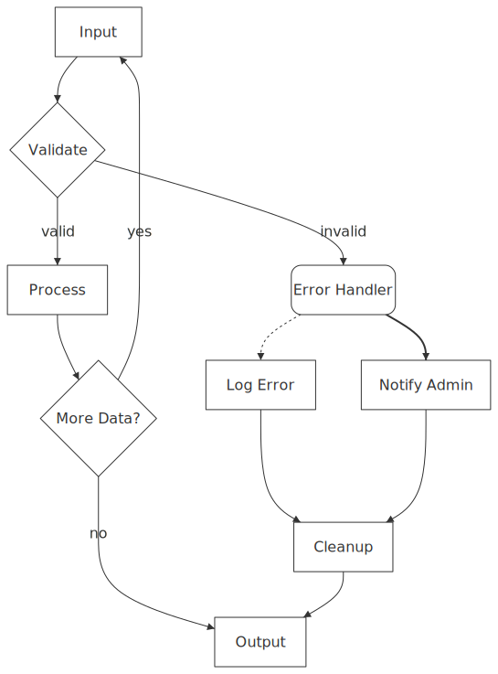

<details>
<summary>Mermaid source</summary>

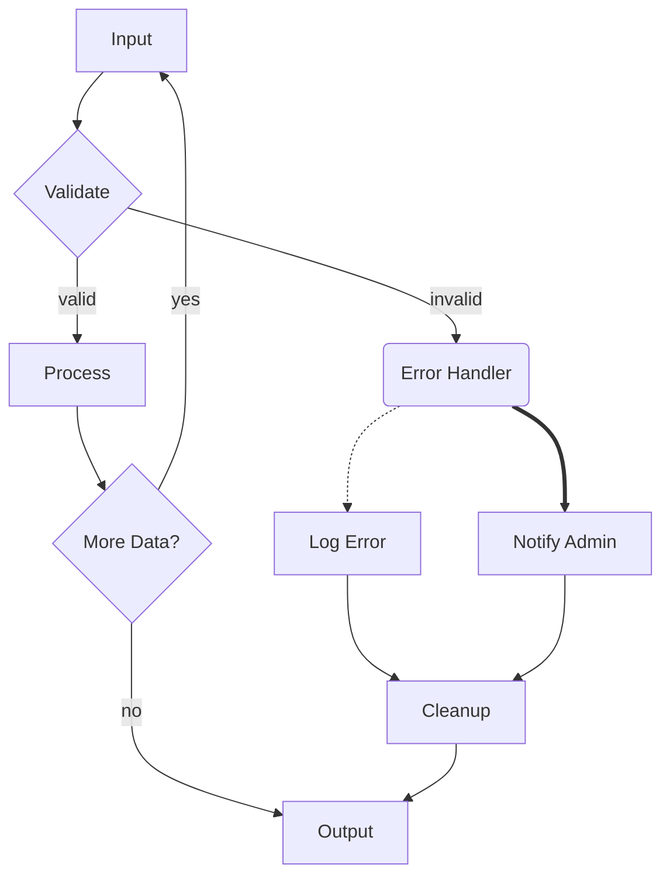

</details>

## cross_circle_arrows

`tests/fixtures/cross_circle_arrows.mmd`

**Text**

```text
┌───┐
│ A │
└───┘
  │
  │
  x
┌───┐
│ B │
└───┘
  │
  │
  o
┌───┐
│ C │
└───┘
  x
  │
  x
┌───┐
│ D │
└───┘
  o
  │
  o
┌───┐
│ E │
└───┘
```

**SVG**

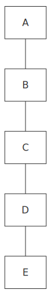

<details>
<summary>Mermaid source</summary>

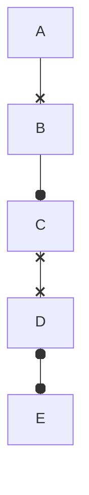

</details>

## decision

`tests/fixtures/decision.mmd`

**Text**

```text
            ┌───────┐
            │ Start │
            └───────┘
         ┌───┘     ▲
         │         └────────┐
         │                  │
         │                  │
         ▼                  │
┌────────────────┐          │
< Is it working? >          │
└────────────────┘          │
 └────┐         └─┐         │
      │           │         │
     Yes         No         │
      │           └───┐     │
      ▼               ▼     │
 ┌────────┐          ┌───────┐
 │ Great! │          │ Debug │
 └────────┘          └───────┘
```

**SVG**

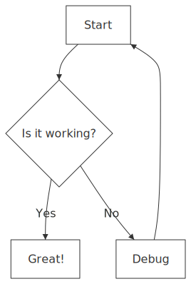

<details>
<summary>Mermaid source</summary>

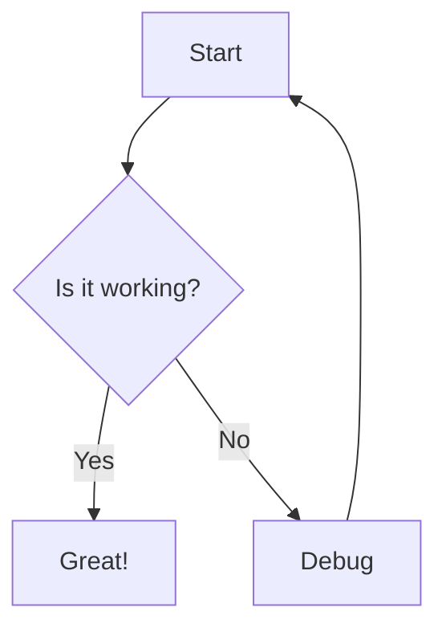

</details>

## diamond_fan

`tests/fixtures/diamond_fan.mmd`

**Text**

```text
      ┌───────┐
      │ Start │
      └───────┘
    ┌──┘     └──┐
    │           │
    ▼           ▼
┌──────┐    ┌───────┐
│ Left │    │ Right │
└──────┘    └───────┘
    │           │
    └───┐   ┌───┘
        ▼   ▼
       ┌─────┐
       │ End │
       └─────┘
```

**SVG**

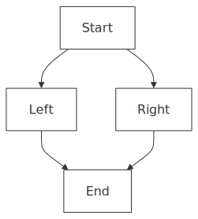

<details>
<summary>Mermaid source</summary>

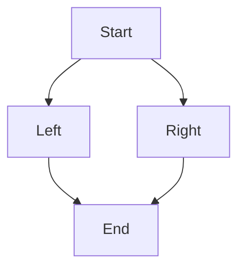

</details>

## direction_override

`tests/fixtures/direction_override.mmd`

**Text**

```text
      ┌───────┐
      │ Start │
      └───────┘
          │
          │
          │
          │
          │
          │
          │
          │
          │
┌──────── Horizontal Section ────────┐
│         │                          │
│         ▼                          │
│ ┌────────┐┌────────┐    ┌────────┐ │
│ │ Step 1 ││ Step 2 │───►│ Step 3 │ │
│ └────────┘└────────┘    └────────┘ │
│         ┌────────────────┘         │
└─────────┼──────────────────────────┘
          │
          │
          │
          │
          │
          │
          │
          │
          │
          ▼
       ┌─────┐
       │ End │
       └─────┘
```

**SVG**

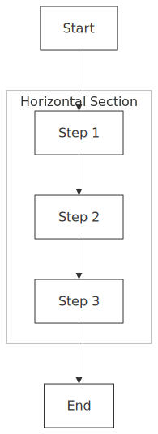

<details>
<summary>Mermaid source</summary>

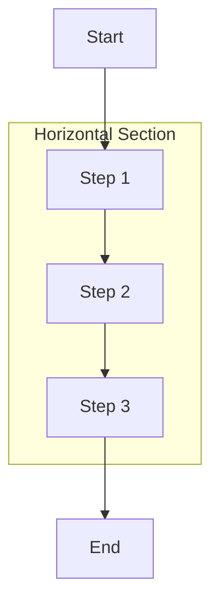

</details>

## double_skip

`tests/fixtures/double_skip.mmd`

**Text**

```text
          ┌───────┐
          │ Start │
          └───────┘
     ┌─────┘  │  │
     │        │  └─┐
     ▼        │    │
┌────────┐    │    │
│ Step 1 │    │    │
└────────┘    │    │
     │        │    │
     └┐      ┌┘    │
      ▼      ▼     │
     ┌────────┐    │
     │ Step 2 │    │
     └────────┘    │
          │        │
          └─┐   ┌──┘
            ▼   ▼
           ┌─────┐
           │ End │
           └─────┘
```

**SVG**

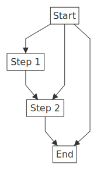

<details>
<summary>Mermaid source</summary>

```mermaid
graph TD
    A[Start] --> B[Step 1]
    B --> C[Step 2]
    C --> D[End]
    A --> C
    A --> D

```

</details>

## edge_styles

`tests/fixtures/edge_styles.mmd`

**Text**

```text
 ┌───────┐    ┌────────┐    ┌───────┐    ┌──────┐
 │ Solid │    │ Dotted │    │ Thick │    │ Open │
 └───────┘    └────────┘    └───────┘    └──────┘
     │            ┆            ┃            │
     │            ┆            ┃            │
     ▼            ▼            ▼            │
┌────────┐    ┌───────┐    ┌───────┐    ┌──────┐
│ Normal │    │ Arrow │    │ Arrow │    │ Line │
└────────┘    └───────┘    └───────┘    └──────┘
```

**SVG**

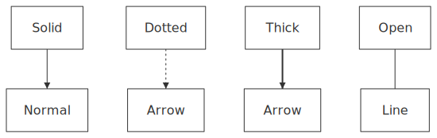

<details>
<summary>Mermaid source</summary>

```mermaid
graph TD
    A[Solid] --> B[Normal]
    C[Dotted] -.-> D[Arrow]
    E[Thick] ==> F[Arrow]
    G[Open] --- H[Line]

```

</details>

## external_node_subgraph

`tests/fixtures/external_node_subgraph.mmd`

**Text**

```text
                         ┌───────────────┐
                         │ Load Balancer │
                         └───────────────┘
                  ┌───────┘             └───────┐
                  │                             │
                  │                             │
                  │                             │
                  │                             │
┌─────────────────┼────────── Cloud ────────────┼────────────────┐
│                 │                             │                │
│     ┌─── US West┼Region ───┐      ┌─── US East┼Region ───┐     │
│     │           ▼          │      │           ▼          │     │
│     │    ┌────────────┐    │      │    ┌────────────┐    │     │
│     │    │ Web Server │    │      │    │ Web Server │    │     │
│     │    └────────────┘    │      │    └────────────┘    │     │
│     │           │          │      │           │          │     │
│     │           │          │      │           │          │     │
│     │           ▼          │      │           ▼          │     │
│     │    ┌────────────┐    │      │    ┌────────────┐    │     │
│     │    │ App Server │    │      │    │ App Server │    │     │
│     │    └────────────┘    │      │    └────────────┘    │     │
│     └──────────────────────┘      └──────────────────────┘     │
│                                                                │
│                                                                │
└────────────────────────────────────────────────────────────────┘
```

**SVG**

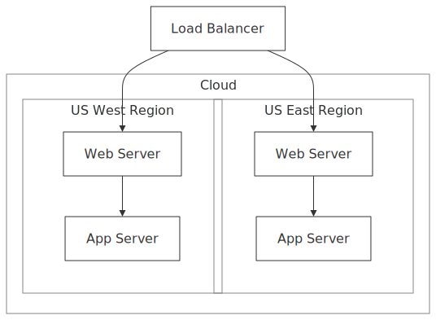

<details>
<summary>Mermaid source</summary>

```mermaid
graph TD
  subgraph Cloud
    subgraph us-east [US East Region]
      A[Web Server] --> B[App Server]
    end
    subgraph us-west [US West Region]
      C[Web Server] --> D[App Server]
    end
  end
  E[Load Balancer] --> A
  E --> C

```

</details>

## fan_in_lr

`tests/fixtures/fan_in_lr.mmd`

**Text**

```text
┌───────┐
│ Src A │┌─┐
└───────┘┘ │
           │
           │
           │
┌───────┐  └►┌────────┐
│ Src B │───►│ Target │
└───────┘  ┌►└────────┘
           │
           │
           │
┌───────┐┐ │
│ Src C │└─┘
└───────┘
```

**SVG**

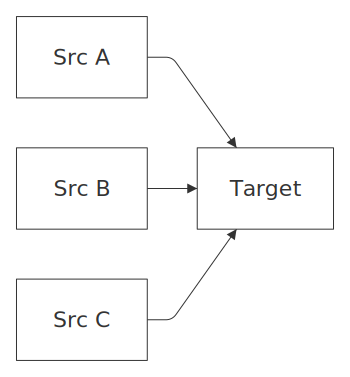

<details>
<summary>Mermaid source</summary>

```mermaid
graph LR
    A[Src A] --> D[Target]
    B[Src B] --> D
    C[Src C] --> D

```

</details>

## fan_in

`tests/fixtures/fan_in.mmd`

**Text**

```text
┌──────────┐    ┌──────────┐    ┌──────────┐
│ Source A │    │ Source B │    │ Source C │
└──────────┘    └──────────┘    └──────────┘
      │              │               │
      └──────────┐  ┌┘  ┌────────────┘
                 ▼  ▼   ▼
                ┌────────┐
                │ Target │
                └────────┘
```

**SVG**

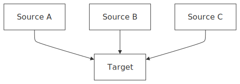

<details>
<summary>Mermaid source</summary>

```mermaid
graph TD
    A[Source A] --> D[Target]
    B[Source B] --> D
    C[Source C] --> D

```

</details>

## fan_out

`tests/fixtures/fan_out.mmd`

**Text**

```text
                ┌────────┐
                │ Source │
                └────────┘
      ┌──────────┘  └┐  └────────────┐
      │              │               │
      ▼              ▼               ▼
┌──────────┐    ┌──────────┐    ┌──────────┐
│ Target A │    │ Target B │    │ Target C │
└──────────┘    └──────────┘    └──────────┘
```

**SVG**

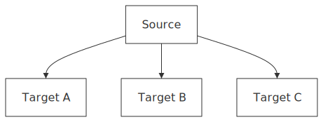

<details>
<summary>Mermaid source</summary>

```mermaid
graph TD
    A[Source] --> B[Target A]
    A --> C[Target B]
    A --> D[Target C]

```

</details>

## five_fan_in

`tests/fixtures/five_fan_in.mmd`

**Text**

```text
┌───┐     ┌───┐     ┌───┐    ┌───┐     ┌───┐
│ A │     │ B │     │ C │    │ D │     │ E │
└───┘     └───┘     └───┘    └───┘     └───┘
  │         │         │        │         │
  └─────────┴─────┬┐ ┌┘┌─┬─────┴─────────┘
                  ▼▼ ▼ ▼ ▼
                 ┌────────┐
                 │ Target │
                 └────────┘
```

**SVG**

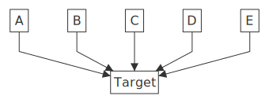

<details>
<summary>Mermaid source</summary>

```mermaid
graph TD
    A[A] --> F[Target]
    B[B] --> F
    C[C] --> F
    D[D] --> F
    E[E] --> F

```

</details>

## git_workflow

`tests/fixtures/git_workflow.mmd`

**Text**

```text
                                 ┌──────────────┐                    ┌────────────┐
               ┌─────git add┐    │ Staging Area │─────git commit────►│ Local Repo │┌─────git push┐
┌─────────────┐┘            └───►└──────────────┘                    └────────────┘┘             └────►┌─────────────┐
│ Working Dir │                                                                                        │ Remote Repo │
└─────────────┘◄───┐                                                                                  ┌└─────────────┘
                   └───────────────────────────────────git pull───────────────────────────────────────┘
```

**SVG**


<details>
<summary>Mermaid source</summary>

```mermaid
graph LR
    %% A typical git workflow
    Working[Working Dir] -->|git add| Staging[Staging Area]
    Staging -->|git commit| Local[Local Repo]
    Local -->|git push| Remote[Remote Repo]
    Remote -->|git pull| Working

```

</details>

## http_request

`tests/fixtures/http_request.mmd`

**Text**

```text
                         ┌────────┐
                         │ Client │◄────────┐
                         └────────┘         │
                     ┌────┘                 │
                     │                      │
               HTTP Request                 │
                     │                      │
                     ▼                      │
                ┌────────┐                  │
                │ Server │                  │
                └────────┘                  │
                     │                      │
                     │                      │
                     │                      │
                     │                      │
                     ▼                HTTP Response
            ┌────────────────┐              │
            < Authenticated? >              │
            └────────────────┘              │
         ┌───┘              └────┐          │
         │                       │          │
         │                       │          │
        Yes                     No          │
         │                       │          │
         ▼                       ▼          │
┌─────────────────┐       ┌──────────────────┐
│ Process Request │       │ 401 Unauthorized │
└─────────────────┘       └──────────────────┘
         │                       │          │
         │                       │          │
         │                       │          │
         └────────────────┐      └──────┐   │
                          ▼             ▼   │
                         ┌───────────────┐  │
                         │ Send Response │──┘
                         └───────────────┘
```

**SVG**

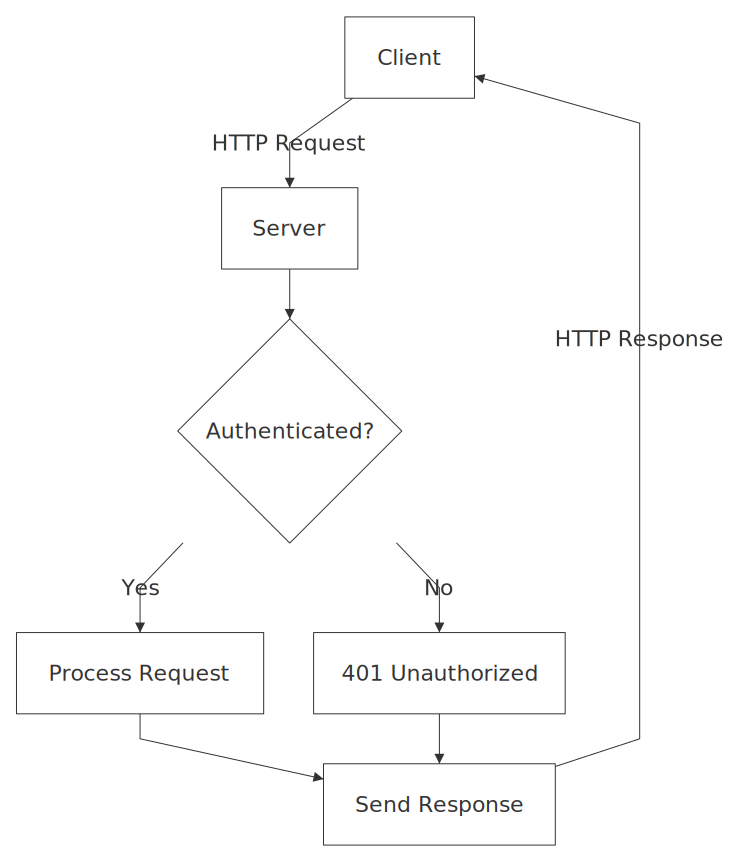

<details>
<summary>Mermaid source</summary>

```mermaid
graph TD
    Client[Client] -->|HTTP Request| Server[Server]
    Server --> Auth{Authenticated?}
    Auth -->|Yes| Process[Process Request]
    Auth -->|No| Reject[401 Unauthorized]
    Process --> Response[Send Response]
    Reject --> Response
    Response -->|HTTP Response| Client

```

</details>

## inline_edge_labels

`tests/fixtures/inline_edge_labels.mmd`

**Text**

```text
 ┌───────┐
 │ Start │
 └───────┘
     │
    yes
     ▼
 ┌──────┐
 │ Next │
 └──────┘
     ┆
   retry
     ▼
 ┌───────┐
 │ Again │
 └───────┘
     ┃
final step
     ┃
     ▼
 ┌──────┐
 │ Done │
 └──────┘
     │
    no
     ▼
 ┌──────┐
 │ Stop │
 └──────┘
```

**SVG**

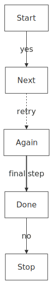

<details>
<summary>Mermaid source</summary>

```mermaid
graph TD
    A[Start] -- yes --> B[Next]
    B -. retry .-> C[Again]
    C == "final step" ==> D[Done]
    D -- no --> E[Stop]

```

</details>

## inline_label_flowchart

`tests/fixtures/inline_label_flowchart.mmd`

**Text**

```text
                                                             ╭───────╮
                                                             │ Start │
                                                             ╰───────╯
                                                                 │
                                                                 │
                                                                 │
                                                                 │
                                                                 ▼
                                                        ┌────────────────┐
                                                        │ Ingest Request │
                                                        └────────────────┘
                                                      ┌──┘              └───────────────────────────────────────────────────┐
                                                      │                                                                     │
                                                      │                                                                     │
                                                      │                                                                     │
                                                      ▼                                                                     ▼
                                              ┌───────────────┐                                                       ┌───────────┐
                                              │ Parse Payload │                                                       │ Audit Log │
                                              └───────────────┘                                                       └───────────┘
                                  ┌────────────┘             └──────────────────────────────────────┐                       │
                                  │                                                                 │                       │
                                  │                                                                 │                       │
                                  │                                                                 │                       │
                                  │                                                                 ▼                       │
                                  │                                                         ┌──────────────┐                │
                                  │                                                         │ Lookup Cache │                │
                                  │                                                         └──────────────┘                │
                                  │                                                  ┌───────┘           ┌┘                 │
                                  │                                                  │                   │                  │
                                  │                                                miss                 hit                 │
                                  │      ┌───────────────────────────────────────────┘                   │                  │
                                  ▼      ▼                                                               ▼                  │
                                 ┌────────┐                                                      ┌──────────────┐           │
                                 < Valid? >                                                      │ Serve Cached │           │
                                 └────────┘                                                      └──────────────┘           │
              ┌───────────────────┘      └────────────┐                                                  │                  │
              │                                       │                                                  │                  │
              │                                       │                                                  │                  │
             no                                      yes                                                 │                  │
              │                                       │                                                  │                  │
              ▼                                       ▼                                                  │                  │
         ┌────────┐                            ┌────────────┐                                            │                  │
         │ Reject │                            < Route Type >                                            │                  │
         └────────┘                            └────────────┘                                            │                  │
       ┌┄┄┘      └────┐               ┌─────────┘          └──────┐                                      │                  │
       ┆              │               │                           │                                      │                  │
       ┆              │             sync                        async                                    │                  │
       ┆              │               │                           │                                      │                  │
       ▼              │               ▼                           ▼                                      │                  │
┌─────────────┐       │       ┌───────────────┐            ┌─────────────┐                               │                  │
│ Notify User │       │       │ Sync Pipeline │            │ Enqueue Job │◄━━┓                           │                  │
└─────────────┘       │       └───────────────┘            └─────────────┘   ┃                           │                  │
                      │               │                   ┌─┘                ┃                           │                  │
                      │               │                   │                  ┃                           │                  │
                      │               │                   │                  ┃                           │                  │
                      │               │                   │                  ┃                           │                  │
                      │               │                   ▼                  ┃                           │                  │
                      │               │            ┌─────────────┐           ┃                           │                  │
                      │               │            │ Worker Pool │           ┃                           │                  │
                      │               │            └─────────────┘           ┃                           │                  │
                      │               │                   │                  ┃                           │                  │
                      │               │                   │                  ┃                           │                  │
                      │               │                   │                  ┃                           │                  │
                      │               │                   │                  ┃                           │                  │
                      │               │                   ▼                  ┃                           │                  │
                      │               │            ┌─────────────┐           ┃                           │                  │
                      │               │            │ Process Job │           ┃                           │                  │
                      │               │            └─────────────┘           ┃                           │                  │
                      │               │             └─────┐     └────────────╋───────────┐               │                  │
                      │               │                   │                  ┃           │               │                  │
                      │               │                   │                  ┃         warn              │                  │
                      │               │                   │                  ┃           │               │                  │
                      │               │                   ▼                  ┃           ▼               │                  │
                      │               │             ┌──────────┐             ┃   ┌──────────────┐        │                  │
                      │               │             < Success? >             ┃   │ Page On-call │        │                  │
                      │               │             └──────────┘             ┃   └──────────────┘        │                  │
                      │               │              └┐       │              ┃           ┆               │                  │
                      │               │               │       │              ┃           ┆               │                  │
                      │               │              yes     no              ┃           ┆               │                  │
                      │           ┌───┘          ┌────┘       └────┐         ┃           ┆               │                  │
                      │           ▼              ▼                 ▼         ┃           ┆               │                  │
                      │          ┌────────────────┐               ┌───────┐  ┃           ┆               │                  │
                      │          │ Persist Result │               │ Retry │━━┛           ┆               │                  │
                      │          └────────────────┘               └───────┘              ┆               │                  │
                      │                   │                                              ┆               │                  │
                      │                   │                                              ┆               │                  │
                      │                   │                                              ┆               │                  │
                      └───────────────────┴───────────────────────────────────────┬──┐  ┌┘ ┌───┬─────────┴──────────────────┘
                                                                                  ▼  ▼  ▼  ▼   ▼
                                                                                 ┌──────────────┐
                                                                                 │ Emit Metrics │
                                                                                 └──────────────┘
                                                                                         │
                                                                                         │
                                                                                         │
                                                                                         │
                                                                                         ▼
                                                                                     ╭──────╮
                                                                                     │ Done │
                                                                                     ╰──────╯
```

**SVG**

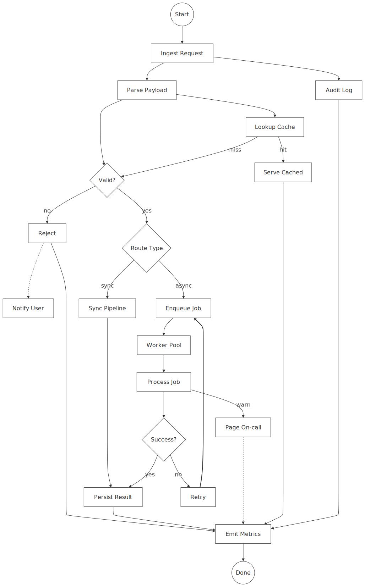

<details>
<summary>Mermaid source</summary>

```mermaid
flowchart TD
  start((Start)) --> ingest[Ingest Request]
  ingest --> parse[Parse Payload]
  parse --> validate{Valid?}

  validate -- no --> reject[Reject]
  reject -.-> notify[Notify User]
  reject --> metrics[Emit Metrics]

  validate -- yes --> route{Route Type}
  route -- sync --> sync[Sync Pipeline]
  route -- async --> queue[Enqueue Job]

  queue --> worker[Worker Pool]
  worker --> process[Process Job]
  process --> success{Success?}

  success -- no --> retry[Retry]
  retry ==> queue

  success -- yes --> persist[Persist Result]
  sync --> persist
  persist --> metrics

  parse --> cache[Lookup Cache]
  cache -- hit --> fastpath[Serve Cached]
  fastpath --> metrics
  cache -- miss --> validate

  ingest --> audit[Audit Log]
  audit --> metrics

  process -- warn --> alert[Page On-call]
  alert -.-> metrics

  metrics --> End((Done))

```

</details>

## label_spacing

`tests/fixtures/label_spacing.mmd`

**Text**

```text
        ┌───┐
        │ A │
        └───┘
  ┌──────┘ └──────┐
  │               │
valid          invalid
  │               │
  ▼               ▼
┌───┐           ┌───┐
│ B │           │ C │
└───┘           └───┘
```

**SVG**

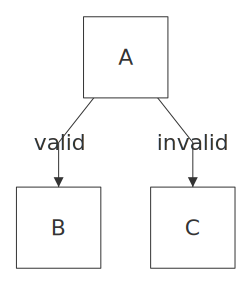

<details>
<summary>Mermaid source</summary>

```mermaid
graph TD
    %% Test case for edge label spacing with branching edges
    %% Labels should not overlap when multiple edges branch from the same source
    A -->|valid| B
    A -->|invalid| C

```

</details>

## labeled_edges

`tests/fixtures/labeled_edges.mmd`

**Text**

```text
           ┌───────┐
           │ Begin │
           └───────┘
               │
               │
          initialize
               │
               ▼
           ┌───────┐
           │ Setup │
           └───────┘
        ┌───┘     ▲
        │         └┄┄┄┄┄┄┄┄┐
        │                  ┆
    configure              ┆
        │                  ┆
        ▼                retry
   ┌────────┐              ┆
   < Valid? >              ┆
   └────────┘              ┆
    └┐     └──────┐        ┆
     │            │        ┆
    yes          no        ┆
     │            └┐       ┆
     ▼             ▼       └┄┄┄┄┐
┌─────────┐       ┌──────────────┐
│ Execute │       │ Handle Error │
└─────────┘       └──────────────┘
```

**SVG**

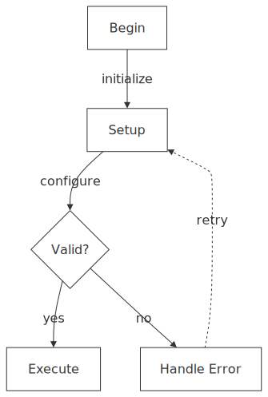

<details>
<summary>Mermaid source</summary>

```mermaid
graph TD
    Start[Begin] -->|initialize| Setup[Setup]
    Setup -->|configure| Config{Valid?}
    Config -->|yes| Run[Execute]
    Config -->|no| Error[Handle Error]
    Error -.->|retry| Setup

```

</details>

## left_right

`tests/fixtures/left_right.mmd`

**Text**

```text
┌────────────┐      ┌──────────────┐     ┌────────────────┐
│ User Input │─────►│ Process Data │────►│ Display Result │
└────────────┘      └──────────────┘     └────────────────┘
```

**SVG**


<details>
<summary>Mermaid source</summary>

```mermaid
graph LR
    Input[User Input] --> Process[Process Data]
    Process --> Output[Display Result]

```

</details>

## multi_edge_labeled

`tests/fixtures/multi_edge_labeled.mmd`

**Text**

```text
  ┌───┐
  │ A │
  └───┘
   │ └──┐
   │ path 2
path 1  │
   │ ┌──┘
   ▼ ▼
  ┌───┐
  │ B │
  └───┘
    │
    │
    │
    │
    ▼
  ┌───┐
  │ C │
  └───┘
```

**SVG**

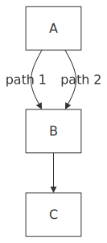

<details>
<summary>Mermaid source</summary>

```mermaid
graph TD
    A -->|path 1| B
    A -->|path 2| B
    B --> C

```

</details>

## multi_edge

`tests/fixtures/multi_edge.mmd`

**Text**

```text
┌───┐
│ A │
└───┘
 └┐│
 ┌┘├─
 ▼ ▼
┌───┐
│ B │
└───┘
```

**SVG**

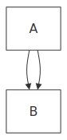

<details>
<summary>Mermaid source</summary>

```mermaid
graph TD
    A --> B
    A --> B

```

</details>

## multi_subgraph

`tests/fixtures/multi_subgraph.mmd`

**Text**

```text
┌─────── Frontend ───────┐            ┌─────── Backend ────────┐
│                        │            │                        │
│  ┌────┐       ┌─────┐  │            │ ┌────────┐      ┌────┐ │
│  │ UI │──────►│ API │──┼────────────┼►│ Server │─────►│ DB │ │
│  └────┘       └─────┘  │            │ └────────┘      └────┘ │
│                        │            │                        │
└────────────────────────┘            └────────────────────────┘
```

**SVG**

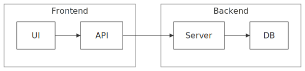

<details>
<summary>Mermaid source</summary>

```mermaid
graph LR
subgraph sg1[Frontend]
A[UI] --> B[API]
end
subgraph sg2[Backend]
C[Server] --> D[DB]
end
B --> C

```

</details>

## multiple_cycles

`tests/fixtures/multiple_cycles.mmd`

**Text**

```text
       ┌─────┐
       │ Top │
       └─────┘
     ┌──┘   ▲
     │      └─┐
     ▼        │
┌────────┐    │
│ Middle │    │
└────────┘    │
 └──┐   ▲     │
   ┌┘  ┌┘     │
   ▼  ┌┘  ┌───┘
  ┌────────┐
  │ Bottom │
  └────────┘
```

**SVG**

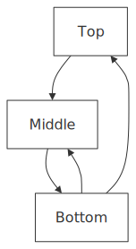

<details>
<summary>Mermaid source</summary>

```mermaid
graph TD
    A[Top] --> B[Middle]
    B --> C[Bottom]
    C --> A
    C --> B

```

</details>

## narrow_fan_in

`tests/fixtures/narrow_fan_in.mmd`

**Text**

```text
┌───┐    ┌───┐    ┌───┐
│ A │    │ B │    │ C │
└───┘    └───┘    └───┘
  │        │        │
  └───────┐│┌───────┘
          ▼▼▼
         ┌───┐
         │ X │
         └───┘
```

**SVG**

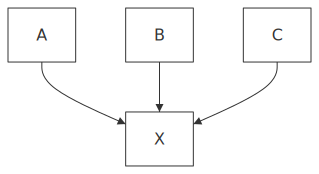

<details>
<summary>Mermaid source</summary>

```mermaid
graph TD
    A[A] --> D[X]
    B[B] --> D
    C[C] --> D

```

</details>

## nested_subgraph_edge

`tests/fixtures/nested_subgraph_edge.mmd`

**Text**

```text
                 ┌────────┐
                 │ Client │
                 └────────┘
                      │
                      │
                      │
                      │
                      ▼
┌────────────────── Cloud ──────────────────┐
│                                           │
│    ┌──────────── US East ────────────┐    │
│    │                                 │    │
│    │   ┌─────────┐     ┌─────────┐   │    │
│    │   │ Server1 │     │ Server2 │   │    │
│    │   └─────────┘     └─────────┘   │    │
│    └─────────────────────────────────┘    │
│                                           │
│                                           │
└─────────────────────┼─────────────────────┘
                      │
                      │
                      │
                      │
                      ▼
               ┌────────────┐
               │ Monitoring │
               └────────────┘
```

**SVG**

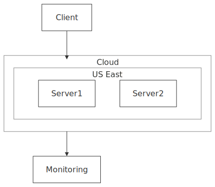

<details>
<summary>Mermaid source</summary>

```mermaid
graph TD
    subgraph cloud[Cloud]
        subgraph region[US East]
            Server1
            Server2
        end
    end
    Client --> cloud
    cloud --> Monitoring

```

</details>

## nested_subgraph_only

`tests/fixtures/nested_subgraph_only.mmd`

**Text**

```text
┌───── Outer ─────┐
│                 │
│                 │
│  ┌── Inner ──┐  │
│  │   ┌───┐   │  │
│  │   │ A │   │  │
│  │   └───┘   │  │
│  │     │     │  │
│  │     │     │  │
│  │     ▼     │  │
│  │   ┌───┐   │  │
│  │   │ B │   │  │
│  │   └───┘   │  │
│  └───────────┘  │
│                 │
│                 │
└─────────────────┘
```

**SVG**

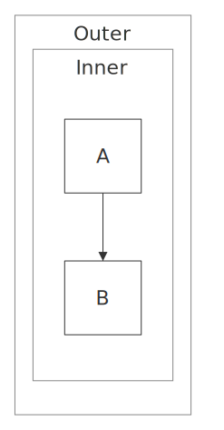

<details>
<summary>Mermaid source</summary>

```mermaid
graph TD
subgraph outer[Outer]
subgraph inner[Inner]
A --> B
end
end

```

</details>

## nested_subgraph

`tests/fixtures/nested_subgraph.mmd`

**Text**

```text
┌───────── Outer ─────────┐
│                         │
│        ┌───────┐        │
│        │ Start │        │
│        └───────┘        │
│            │            │
│            │            │
│            │            │
│            │            │
│    ┌──── Inner ────┐    │
│    │       ▼       │    │
│    │  ┌─────────┐  │    │
│    │  │ Process │  │    │
│    │  └─────────┘  │    │
│    │       │       │    │
│    │       │       │    │
│    │       ▼       │    │
│    │    ┌─────┐    │    │
│    │    │ End │    │    │
│    │    └─────┘    │    │
│    └───────────────┘    │
└─────────────────────────┘
```

**SVG**

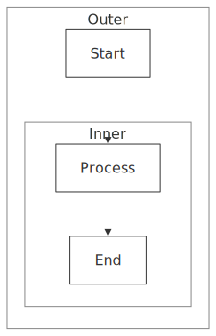

<details>
<summary>Mermaid source</summary>

```mermaid
graph TD
subgraph outer[Outer]
A[Start]
subgraph inner[Inner]
B[Process] --> C[End]
end
end
A --> B

```

</details>

## nested_with_siblings

`tests/fixtures/nested_with_siblings.mmd`

**Text**

```text
┌───────────────────── Outer ──────────────────────┐
│                                                  │
│    ┌──── Left ────┐         ┌──── Right ─────┐   │
│    │              │         │                │   │
│    │┌───┐    ┌───┐│         │ ┌───┐    ┌───┐ │   │
│    ││ A │───►│ B │┼─────────┼►│ C │───►│ D │ │   │
│    │└───┘    └───┘│         │ └───┘    └───┘ │   │
│    │              │         │                │   │
│    └──────────────┘         └────────────────┘   │
│                                                  │
└──────────────────────────────────────────────────┘
```

**SVG**

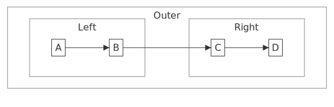

<details>
<summary>Mermaid source</summary>

```mermaid
graph LR
subgraph outer[Outer]
subgraph left[Left]
A --> B
end
subgraph right[Right]
C --> D
end
end
B --> C

```

</details>

## right_left

`tests/fixtures/right_left.mmd`

**Text**

```text
┌───────┐     ┌─────────┐    ┌────────┐
│ Begin │◄────│ Process │◄───│ Finish │
└───────┘     └─────────┘    └────────┘
```

**SVG**


<details>
<summary>Mermaid source</summary>

```mermaid
graph RL
    End[Finish] --> Middle[Process]
    Middle --> Start[Begin]

```

</details>

## self_loop_labeled

`tests/fixtures/self_loop_labeled.mmd`

**Text**

```text
 ┌───────┐
 │ Start │
 └───────┘
     │
     │
     │
     │
     ▼
┌────────┐───┐
< Retry? > retry
└────────┘◄──┘
     │
     │
   done
     │
     ▼
  ┌─────┐
  │ End │
  └─────┘
```

**SVG**


<details>
<summary>Mermaid source</summary>

```mermaid
graph TD
    A[Start] --> B{Retry?}
    B -->|retry| B
    B -->|done| C[End]

```

</details>

## self_loop_with_others

`tests/fixtures/self_loop_with_others.mmd`

**Text**

```text
 ┌───────┐
 │ Start │
 └───────┘
     │
     │
     ▼
┌─────────┐───┐
│ Process │   │
└─────────┘◄──┘
     │
     │
     ▼
  ┌─────┐
  │ End │
  └─────┘
```

**SVG**


<details>
<summary>Mermaid source</summary>

```mermaid
graph TD
    A[Start] --> B[Process]
    B --> B
    B --> C[End]

```

</details>

## self_loop

`tests/fixtures/self_loop.mmd`

**Text**

```text
┌─────────┐───┐
│ Process │   │
└─────────┘◄──┘
```

**SVG**


<details>
<summary>Mermaid source</summary>

```mermaid
graph TD
    A[Process] --> A

```

</details>

## shapes_basic

`tests/fixtures/shapes_basic.mmd`

**Text**

```text
 ┌───────────┐
 │ Rectangle │
 └───────────┘
       │
       │
       ▼
  ╭─────────╮
  │ Rounded │
  ╰─────────╯
       │
       │
       ▼
  ╭─────────╮
  │ Stadium │
  ╰─────────╯
       │
       │
       ▼
┌────────────┐
║ Subroutine ║
└────────────┘
       │
       │
       ▼
 ┌──────────┐
 ( Cylinder )
 └──────────┘
       │
       │
       ▼
 ┌──────────┐
 < Decision >
 └──────────┘
       │
       │
       ▼
  ┌─────────┐
  < Hexagon >
  └─────────┘
```

**SVG**


<details>
<summary>Mermaid source</summary>

```mermaid
graph TD
    rect[Rectangle]
    round(Rounded)
    stadium([Stadium])
    sub[[Subroutine]]
    cyl[(Cylinder)]
    diamond{Decision}
    hex{{Hexagon}}
    rect --> round --> stadium --> sub --> cyl --> diamond --> hex

```

</details>

## shapes_degenerate

`tests/fixtures/shapes_degenerate.mmd`

**Text**

```text
┌───────┐
│ Cloud │
└───────┘
    │
    │
    ▼
┌──────┐
│ Bolt │
└──────┘
    │
    │
    ▼
┌──────┐
│ Bang │
└──────┘
    │
    │
    ▼
┌──────┐
│ Icon │
└──────┘
    │
    │
    ▼
┌──────┐
│ Hour │
└──────┘
    │
    │
    ▼
 ┌─────┐
 │ Tri │
 └─────┘
    │
    │
    ▼
┌──────┐
│ Flip │
└──────┘
    │
    │
    ▼
┌───────┐
│ Notch │
└───────┘
```

**SVG**


<details>
<summary>Mermaid source</summary>

```mermaid
graph TD
    cloud@{shape: cloud, label: "Cloud"}
    bolt@{shape: bolt, label: "Bolt"}
    bang@{shape: bang, label: "Bang"}
    icon@{shape: icon, label: "Icon"}
    hourglass@{shape: hourglass, label: "Hour"}
    tri@{shape: tri, label: "Tri"}
    flip@{shape: flip-tri, label: "Flip"}
    notch@{shape: notch-pent, label: "Notch"}
    cloud --> bolt --> bang --> icon --> hourglass --> tri --> flip --> notch

```

</details>

## shapes_document

`tests/fixtures/shapes_document.mmd`

**Text**

```text
  ┌─────┐
  │ Doc │
  └~~~~~┘
     │
     │
     ▼
 ┌──────┐
 │ Docs ││
 └~~~~~~┘│
  ───│───┘
     │
     ▼
┌───────╱┐
│ TagDoc │
└~~~~~~~~┘
     │
     │
     ▼
 ┌─────╱┐
 │ Card │
 └──────┘
     │
     │
     ▼
  ┌────╱┐
  │ Tag │
  └─────┘
```

**SVG**


<details>
<summary>Mermaid source</summary>

```mermaid
graph TD
    doc@{shape: doc, label: "Doc"}
    docs@{shape: docs, label: "Docs"}
    tagdoc@{shape: tag-doc, label: "TagDoc"}
    card@{shape: card, label: "Card"}
    tag@{shape: tag-rect, label: "Tag"}
    doc --> docs --> tagdoc --> card --> tag

```

</details>

## shapes_junction

`tests/fixtures/shapes_junction.mmd`

**Text**

```text
●  ───► ◉  ───► ⊗
```

**SVG**


<details>
<summary>Mermaid source</summary>

```mermaid
graph LR
    j1@{shape: sm-circ}
    j2@{shape: fr-circ}
    j3@{shape: cross-circ}
    j1 --> j2 --> j3

```

</details>

## shapes_special

`tests/fixtures/shapes_special.mmd`

**Text**

```text
┃
┃
┃ ─────►  Note
┃
```

**SVG**


<details>
<summary>Mermaid source</summary>

```mermaid
graph LR
    fork@{shape: fork}
    note@{shape: text, label: "Note"}
    fork --> note

```

</details>

## shapes

`tests/fixtures/shapes.mmd`

**Text**

```text
┌────────────────┐
│ Rectangle Node │
└────────────────┘
         │
         │
         ▼
 ╭──────────────╮
 │ Rounded Node │
 ╰──────────────╯
         │
         │
         ▼
 ┌──────────────┐
 < Diamond Node >
 └──────────────┘
```

**SVG**


<details>
<summary>Mermaid source</summary>

```mermaid
graph TD
    rect[Rectangle Node]
    round(Rounded Node)
    diamond{Diamond Node}
    rect --> round --> diamond

```

</details>

## simple_cycle

`tests/fixtures/simple_cycle.mmd`

**Text**

```text
      ┌───────┐
      │ Start │
      └───────┘
     ┌─┘     ▲
     │       └┐
     ▼        │
┌─────────┐   │
│ Process │   │
└─────────┘   │
     │        │
     └──┐     │
        ▼   ┌─┘
       ┌─────┐
       │ End │
       └─────┘
```

**SVG**


<details>
<summary>Mermaid source</summary>

```mermaid
graph TD
    A[Start] --> B[Process]
    B --> C[End]
    C --> A

```

</details>

## simple_subgraph

`tests/fixtures/simple_subgraph.mmd`

**Text**

```text
┌── Process ───┐
│   ┌───────┐  │
│   │ Start │  │
│   └───────┘  │
│       │      │
│       │      │
│       ▼      │
│  ┌────────┐  │
│  │ Middle │  │
│  └────────┘  │
└───────┼──────┘
        │
        │
        │
        │
        ▼
     ┌─────┐
     │ End │
     └─────┘
```

**SVG**


<details>
<summary>Mermaid source</summary>

```mermaid
graph TD
subgraph sg1[Process]
A[Start] --> B[Middle]
end
B --> C[End]

```

</details>

## simple

`tests/fixtures/simple.mmd`

**Text**

```text
┌───────┐
│ Start │
└───────┘
    │
    │
    ▼
 ┌─────┐
 │ End │
 └─────┘
```

**SVG**


<details>
<summary>Mermaid source</summary>

```mermaid
graph TD
    A[Start] --> B[End]

```

</details>

## skip_edge_collision

`tests/fixtures/skip_edge_collision.mmd`

**Text**

```text
      ┌───────┐
      │ Start │
      └───────┘
     ┌─┘     └┐
     │        │
     ▼        │
┌────────┐    │
│ Step 1 │    │
└────────┘    │
     │        │
     │        │
     ▼        │
┌────────┐    │
│ Step 2 │    │
└────────┘    │
     │        │
     └──┐   ┌─┘
        ▼   ▼
       ┌─────┐
       │ End │
       └─────┘
```

**SVG**


<details>
<summary>Mermaid source</summary>

```mermaid
graph TD
    A[Start] --> B[Step 1]
    B --> C[Step 2]
    C --> D[End]
    A --> D

```

</details>

## stacked_fan_in

`tests/fixtures/stacked_fan_in.mmd`

**Text**

```text
   ┌─────┐
   │ Top │
   └─────┘
   ┌┘   └─┐
   │      │
   ▼      │
┌─────┐   │
│ Mid │   │
└─────┘   │
   │      │
   └┐   ┌─┘
    ▼   ▼
   ┌─────┐
   │ Bot │
   └─────┘
```

**SVG**


<details>
<summary>Mermaid source</summary>

```mermaid
graph TD
    A[Top] --> B[Mid]
    B --> C[Bot]
    A --> C

```

</details>

## subgraph_as_node_edge

`tests/fixtures/subgraph_as_node_edge.mmd`

**Text**

```text
     ┌────────┐
     │ Client │
     └────────┘
          │
          │
          │
          ▼
┌──── Backend ─────┐
│                  │
│  ┌────────────┐  │
│  │ API Server │  │
│  └────────────┘  │
│         │        │
│         │        │
│         ▼        │
│   ┌──────────┐   │
│   │ Database │   │
│   └──────────┘   │
└─────────┼────────┘
          │
          │
          │
          │
          ▼
      ┌──────┐
      │ Logs │
      └──────┘
```

**SVG**


<details>
<summary>Mermaid source</summary>

```mermaid
graph TD
    subgraph sg1[Backend]
        API[API Server]
        DB[Database]
        API --> DB
    end
    Client --> sg1
    sg1 --> Logs

```

</details>

## subgraph_direction_cross_boundary

`tests/fixtures/subgraph_direction_cross_boundary.mmd`

**Text**

```text
              ┌───┐
              │ C │
              └───┘
             ┌─┘ └───────────┐
             │               │
             │               ▼
             │             ┌───┐
             │             │ X │
             │             └───┘
             │               │
             │               │
             │               ▼
             │             ┌───┐
             │             │ Y │
             │             └───┘
             │               │
             │               │
             │               ▼
             │             ┌───┐
             │             │ Z │
             │             └───┘
             │    ┌─────────┘
             │    │
             │    │
    ┌─ Horizontal Section ─┐
    │      │ │             │
    │      ▼ ▼             │
    │     ┌───┐  ┌───┐     │
   ┌┼─────│ A │─►│ B │     │
   ▼│     └───┘  └───┘     │
┌───┐            ┌┘        │
│ E │────────────┼─────────┘
└───┘            │
  │              │
  │              │
  │              │
  │              │
  │              │
  ▼              │
┌───┐            │
│ F │            │
└───┘            │
  │              │
  └────────────┐ │
               ▼ ▼
              ┌───┐
              │ D │
              └───┘
```

**SVG**


<details>
<summary>Mermaid source</summary>

```mermaid
graph TD
    subgraph s1[Horizontal Section]
        direction LR
        A --> B
    end
    C --> A
    C --> X --> Y --> Z --> A
    A --> E --> F --> D
    B --> D

```

</details>

## subgraph_direction_lr

`tests/fixtures/subgraph_direction_lr.mmd`

**Text**

```text
      ┌───────┐
      │ Start │
      └───────┘
          │
          │
          │
          │
          │
          │
          │
          │
          │
┌─────────┼Horizontal Flow ──────────┐
│         │                          │
│         ▼                          │
│ ┌────────┐┌────────┐    ┌────────┐ │
│ │ Step 1 ││ Step 2 │───►│ Step 3 │ │
│ └────────┘└────────┘    └────────┘ │
│         ┌────────────────┘         │
└─────────┼──────────────────────────┘
          │
          │
          │
          │
          │
          │
          │
          │
          │
          ▼
       ┌─────┐
       │ End │
       └─────┘
```

**SVG**


<details>
<summary>Mermaid source</summary>

```mermaid
graph TD
    Start --> A
    subgraph sg1[Horizontal Flow]
        direction LR
        A[Step 1] --> B[Step 2] --> C[Step 3]
    end
    C --> End

```

</details>

## subgraph_direction_mixed

`tests/fixtures/subgraph_direction_mixed.mmd`

**Text**

```text
┌─ Left to Right ─┐
│                 │
│                 │
│  ┌───┐  ┌───┐   │
│  │ A │─►│ B │   │
│  └───┘  └───┘   │
│       ┌──┘      │
└───────┼─────────┘
        │
        │
        │
        │
        │
        │
        │
        │
┌─ Bottom to Top ─┐
│       │         │
│       │         │
│      ┌───┐      │
│      │ D │      │
│      └───┘      │
│       │▲        │
│       ▼└┐       │
│      ┌───┐      │
│      │ C │      │
│      └───┘      │
│                 │
└─────────────────┘
```

**SVG**


<details>
<summary>Mermaid source</summary>

```mermaid
graph TD
    subgraph lr_group[Left to Right]
        direction LR
        A --> B
    end
    subgraph bt_group[Bottom to Top]
        direction BT
        C --> D
    end
    B --> C

```

</details>

## subgraph_direction_nested_both

`tests/fixtures/subgraph_direction_nested_both.mmd`

**Text**

```text
          ┌───┐
          │ D │
          └───┘
            │
            │
            │
            │
            │
            │
            │
            │
            │
            │
            │
┌────── Outer LR ───────┐
│    ┌──────┘           │
│    │  ┌─ Inner BT ─┐  │
│    │  │            │  │
│    │  │            │  │
│    │  │   ┌───┐    │  │
│    │  │   │ B │    │  │
│    │  │   └───┘    │  │
│    │  │     ▲      │  │
│    ▼  │     │      │  │
│ ┌───┐ │   ┌───┐    │  │
│ │ C │─┼──►│ A │    │  │
│ └───┘ │   └───┘    │  │
│       │            │  │
│       └────────────┘  │
└───────────────────────┘
```

**SVG**


<details>
<summary>Mermaid source</summary>

```mermaid
graph TD
    subgraph outer[Outer LR]
        direction LR
        subgraph inner[Inner BT]
            direction BT
            A --> B
        end
        C --> A
    end
    D --> C

```

</details>

## subgraph_direction_nested

`tests/fixtures/subgraph_direction_nested.mmd`

**Text**

```text
┌──── Vertical Outer ─────┐
│                         │
│          ┌───┐          │
│          │ D │          │
│          └───┘          │
│            │            │
│            │            │
│            │            │
│            │            │
│            │            │
│            │            │
│            │            │
│     ┌──────┘            │
│     │                   │
│┌── Horizontal Inner ───┐│
││    │                  ││
││    ▼                  ││
││ ┌───┐  ┌───┐    ┌───┐ ││
││ │ A │─►│ B │───►│ C │ ││
││ └───┘  └───┘    └───┘ ││
││                       ││
│└───────────────────────┘│
│                         │
│                         │
│                         │
│                         │
│                         │
└─────────────────────────┘
```

**SVG**


<details>
<summary>Mermaid source</summary>

```mermaid
graph TD
    subgraph outer[Vertical Outer]
        subgraph inner[Horizontal Inner]
            direction LR
            A --> B --> C
        end
        D --> A
    end

```

</details>

## subgraph_edges_bottom_top

`tests/fixtures/subgraph_edges_bottom_top.mmd`

**Text**

```text
┌───────── Output ──────────┐
│   ┌────────┐    ┌─────┐   │
│   │ Result │    │ Log │   │
│   └────────┘    └─────┘   │
│        ▲           ▲      │
└────────┼───────────┼──────┘
         │           │
         │           │
         │           │
         │           │
         │           │
         │           │
  ┌──────┼── Input ──┼───────┐
  │  ┌──────┐    ┌────────┐  │
  │  │ Data │    │ Config │  │
  │  └──────┘    └────────┘  │
  └──────────────────────────┘
```

**SVG**


<details>
<summary>Mermaid source</summary>

```mermaid
graph BT
subgraph sg1[Input]
A[Data]
B[Config]
end
subgraph sg2[Output]
C[Result]
D[Log]
end
A --> C
B --> D

```

</details>

## subgraph_edges

`tests/fixtures/subgraph_edges.mmd`

**Text**

```text
  ┌───────── Input ──────────┐
  │  ┌──────┐    ┌────────┐  │
  │  │ Data │    │ Config │  │
  │  └──────┘    └────────┘  │
  └──────┼───────────┼───────┘
         │           │
         │           │
         │           │
         │           │
         │           │
         │           │
┌────────┼ Output ───┼──────┐
│        ▼           ▼      │
│   ┌────────┐    ┌─────┐   │
│   │ Result │    │ Log │   │
│   └────────┘    └─────┘   │
└───────────────────────────┘
```

**SVG**


<details>
<summary>Mermaid source</summary>

```mermaid
graph TD
subgraph sg1[Input]
A[Data]
B[Config]
end
subgraph sg2[Output]
C[Result]
D[Log]
end
A --> C
B --> D

```

</details>

## subgraph_multi_word_title

`tests/fixtures/subgraph_multi_word_title.mmd`

**Text**

```text
      ┌────────┐
      │ Source │
      └────────┘
           │
           │
           │
           │
┌─ Data Processing Pipeline ─┐
│          ▼                 │
│     ┌─────────┐            │
│     │ Extract │            │
│     └─────────┘            │
│          │                 │
│          │                 │
│          ▼                 │
│    ┌───────────┐           │
│    │ Transform │           │
│    └───────────┘           │
│          │                 │
│          │                 │
│          ▼                 │
│      ┌──────┐              │
│      │ Load │              │
│      └──────┘              │
└──────────┼─────────────────┘
           │
           │
           │
           │
           ▼
       ┌──────┐
       │ Sink │
       └──────┘
```

**SVG**


<details>
<summary>Mermaid source</summary>

```mermaid
graph TD
    subgraph "Data Processing Pipeline"
        Extract[Extract] --> Transform[Transform] --> Load[Load]
    end
    Source --> Extract
    Load --> Sink

```

</details>

## subgraph_numeric_id

`tests/fixtures/subgraph_numeric_id.mmd`

**Text**

```text
┌─ Phase 1 ─┐
│    ┌───┐  │
│    │ A │  │
│    └───┘  │
│      │    │
│      │    │
│      ▼    │
│    ┌───┐  │
│    │ B │  │
│    └───┘  │
└──────┼────┘
       │
       │
       │
       │
       │
       │
┌─ Phase 2 ─┐
│      ▼    │
│    ┌───┐  │
│    │ C │  │
│    └───┘  │
│      │    │
│      │    │
│      ▼    │
│    ┌───┐  │
│    │ D │  │
│    └───┘  │
└───────────┘
```

**SVG**


<details>
<summary>Mermaid source</summary>

```mermaid
graph TD
    subgraph 1phase[Phase 1]
        A --> B
    end
    subgraph 2phase[Phase 2]
        C --> D
    end
    B --> C

```

</details>

## subgraph_to_subgraph_edge

`tests/fixtures/subgraph_to_subgraph_edge.mmd`

**Text**

```text
┌─────── Frontend ───────┐
│   ┌────────────────┐   │
│   │ User Interface │   │
│   └────────────────┘   │
│            │           │
│            │           │
│            ▼           │
│    ┌───────────────┐   │
│    │ State Manager │   │
│    └───────────────┘   │
└────────────┼───────────┘
             │
             │
             │
             │
             │
             ▼
 ┌────── Backend ───────┐
 │                      │
 │    ┌────────────┐    │
 │    │ API Server │    │
 │    └────────────┘    │
 │           │          │
 │           │          │
 │           ▼          │
 │     ┌──────────┐     │
 │     │ Database │     │
 │     └──────────┘     │
 └──────────────────────┘
```

**SVG**


<details>
<summary>Mermaid source</summary>

```mermaid
graph TD
    subgraph frontend[Frontend]
        UI[User Interface]
        State[State Manager]
        UI --> State
    end
    subgraph backend[Backend]
        API[API Server]
        DB[Database]
        API --> DB
    end
    frontend --> backend

```

</details>

## very_narrow_fan_in

`tests/fixtures/very_narrow_fan_in.mmd`

**Text**

```text
┌───┐    ┌───┐    ┌───┐    ┌───┐
│ X │    │ X │    │ X │    │ X │
└───┘    └───┘    └───┘    └───┘
  │        │        │        │
  └────────┴───┐┌┬──┴────────┘
               ▼▼▼
              ┌───┐
              │ Y │
              └───┘
```

**SVG**


<details>
<summary>Mermaid source</summary>

```mermaid
graph TD
    A[X] --> E[Y]
    B[X] --> E
    C[X] --> E
    D[X] --> E

```

</details>

