# mmdflux gallery

_Generated from commit `6a4dcda` — 106 fixtures_

- [Flowchart](#flowchart) (89)
- [Class](#class) (17)

# Flowchart

## ampersand

`tests/fixtures/flowchart/ampersand.mmd`

> Missing text snapshot: `tests/snapshots/flowchart/ampersand.txt`

<details>
<summary>SVG output</summary>

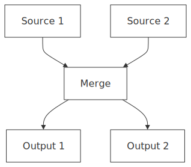

</details>

<details>
<summary>Mermaid source</summary>

```
graph TD
    A[Source 1] & B[Source 2] --> C[Merge]
    C --> D[Output 1] & E[Output 2]

```

</details>

## backward_in_subgraph_lr

`tests/fixtures/flowchart/backward_in_subgraph_lr.mmd`

> Missing text snapshot: `tests/snapshots/flowchart/backward_in_subgraph_lr.txt`

<details>
<summary>SVG output</summary>

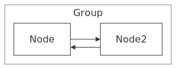

</details>

<details>
<summary>Mermaid source</summary>

```
graph TD
    subgraph sg1[Group]
        direction LR
        A[Node] --> B[Node2]
        B --> A
    end

```

</details>

## backward_in_subgraph

`tests/fixtures/flowchart/backward_in_subgraph.mmd`

> Missing text snapshot: `tests/snapshots/flowchart/backward_in_subgraph.txt`

<details>
<summary>SVG output</summary>

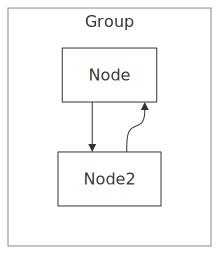

</details>

<details>
<summary>Mermaid source</summary>

```
graph TD
subgraph sg1[Group]
A[Node] --> B[Node2]
B --> A
end

```

</details>

## backward_loop_lr

`tests/fixtures/flowchart/backward_loop_lr.mmd`

> Missing text snapshot: `tests/snapshots/flowchart/backward_loop_lr.txt`

<details>
<summary>SVG output</summary>

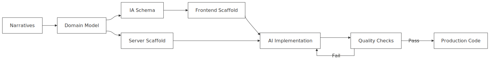

</details>

<details>
<summary>Mermaid source</summary>

```
flowchart LR
    A[Narratives] --> B[Domain Model]
    B --> C[Server Scaffold]
    B --> D[IA Schema]
    D --> E[Frontend Scaffold]
    C --> F[AI Implementation]
    E --> F
    F --> G[Quality Checks]
    G -->|Fail| F
    G -->|Pass| H[Production Code]

```

</details>

## bidirectional_arrows

`tests/fixtures/flowchart/bidirectional_arrows.mmd`

> Missing text snapshot: `tests/snapshots/flowchart/bidirectional_arrows.txt`

<details>
<summary>SVG output</summary>


</details>

<details>
<summary>Mermaid source</summary>

```
graph TD
    A <--> B
    B <-.-> C
    C <==> D

```

</details>

## bidirectional

`tests/fixtures/flowchart/bidirectional.mmd`

> Missing text snapshot: `tests/snapshots/flowchart/bidirectional.txt`

<details>
<summary>SVG output</summary>

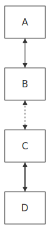

</details>

<details>
<summary>Mermaid source</summary>

```
graph TD
    A <--> B
    B <-.-> C
    C <==> D

```

</details>

## bottom_top

`tests/fixtures/flowchart/bottom_top.mmd`

> Missing text snapshot: `tests/snapshots/flowchart/bottom_top.txt`

<details>
<summary>SVG output</summary>

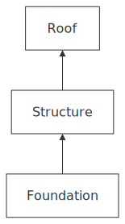

</details>

<details>
<summary>Mermaid source</summary>

```
graph BT
    Foundation[Foundation] --> Structure[Structure]
    Structure --> Roof[Roof]

```

</details>

## br_line_breaks

`tests/fixtures/flowchart/br_line_breaks.mmd`

> Missing text snapshot: `tests/snapshots/flowchart/br_line_breaks.txt`

<details>
<summary>SVG output</summary>

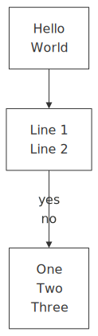

</details>

<details>
<summary>Mermaid source</summary>

```
graph TD
    A[Hello<br>World] --> B[Line 1<br/>Line 2]
    B -->|yes<br>no| C[One<BR>Two<BR />Three]

```

</details>

## chain

`tests/fixtures/flowchart/chain.mmd`

> Missing text snapshot: `tests/snapshots/flowchart/chain.txt`

<details>
<summary>SVG output</summary>

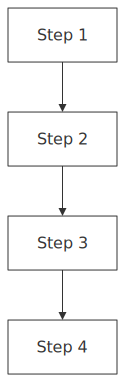

</details>

<details>
<summary>Mermaid source</summary>

```
graph TD
    A[Step 1] --> B[Step 2] --> C[Step 3] --> D[Step 4]

```

</details>

## ci_pipeline

`tests/fixtures/flowchart/ci_pipeline.mmd`

> Missing text snapshot: `tests/snapshots/flowchart/ci_pipeline.txt`

<details>
<summary>SVG output</summary>

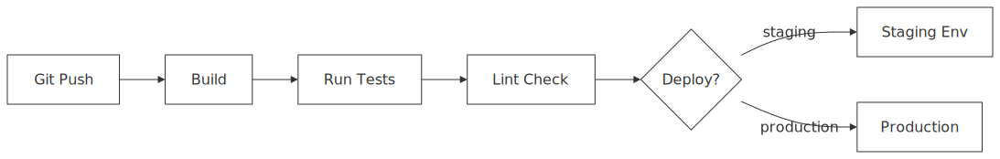

</details>

<details>
<summary>Mermaid source</summary>

```
graph LR
    Push[Git Push] --> Build[Build]
    Build --> Test[Run Tests]
    Test --> Lint[Lint Check]
    Lint --> Deploy{Deploy?}
    Deploy -->|staging| Staging[Staging Env]
    Deploy -->|production| Prod[Production]

```

</details>

## compat_class_annotation

`tests/fixtures/flowchart/compat_class_annotation.mmd`

> Missing text snapshot: `tests/snapshots/flowchart/compat_class_annotation.txt`

<details>
<summary>SVG output</summary>

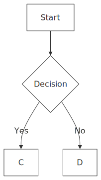

</details>

<details>
<summary>Mermaid source</summary>

```
graph TD
    A[Start]:::highlight --> B{Decision}
    B -->|Yes| C:::success
    B -->|No| D:::error
    classDef highlight fill:#ff0
    classDef success fill:#0f0
    classDef error fill:#f00

```

</details>

## compat_directive

`tests/fixtures/flowchart/compat_directive.mmd`

> Missing text snapshot: `tests/snapshots/flowchart/compat_directive.txt`

<details>
<summary>SVG output</summary>

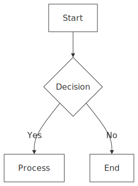

</details>

<details>
<summary>Mermaid source</summary>

```
%%{init: {"theme": "dark", "flowchart": {"curve": "basis"}}}%%
graph TD
    A[Start] --> B{Decision}
    B -->|Yes| C[Process]
    B -->|No| D[End]

```

</details>

## compat_frontmatter

`tests/fixtures/flowchart/compat_frontmatter.mmd`

> Missing text snapshot: `tests/snapshots/flowchart/compat_frontmatter.txt`

<details>
<summary>SVG output</summary>

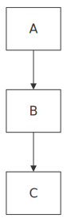

</details>

<details>
<summary>Mermaid source</summary>

```
---
config:
  theme: dark
---
graph TD
    A --> B --> C

```

</details>

## compat_hyphenated_ids

`tests/fixtures/flowchart/compat_hyphenated_ids.mmd`

> Missing text snapshot: `tests/snapshots/flowchart/compat_hyphenated_ids.txt`

<details>
<summary>SVG output</summary>

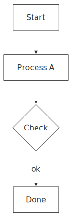

</details>

<details>
<summary>Mermaid source</summary>

```
graph TD
    start-node[Start] --> process-1[Process A]
    process-1 --> decision-point{Check}
    decision-point -->|ok| end-node[Done]

```

</details>

## compat_invisible_edge

`tests/fixtures/flowchart/compat_invisible_edge.mmd`

> Missing text snapshot: `tests/snapshots/flowchart/compat_invisible_edge.txt`

<details>
<summary>SVG output</summary>

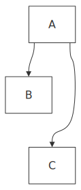

</details>

<details>
<summary>Mermaid source</summary>

```
graph TD
    A --> B
    A --> C
    B ~~~ C

```

</details>

## compat_kitchen_sink

`tests/fixtures/flowchart/compat_kitchen_sink.mmd`

> Missing text snapshot: `tests/snapshots/flowchart/compat_kitchen_sink.txt`

<details>
<summary>SVG output</summary>

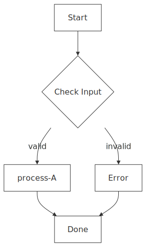

</details>

<details>
<summary>Mermaid source</summary>

```
---
config:
  theme: default
---
%%{init: {"flowchart": {"curve": "basis"}}}%%
graph TD
    start-node[Start] --> check-1{Check Input}
    check-1 -->|valid| process-A:::success
    check-1 -->|invalid| error-1[Error]:::error
    process-A --> end-node[Done]
    error-1 --> end-node
    style start-node fill:#f9f
    classDef success fill:#0f0
    classDef error fill:#f00

```

</details>

## compat_no_direction

`tests/fixtures/flowchart/compat_no_direction.mmd`

> Missing text snapshot: `tests/snapshots/flowchart/compat_no_direction.txt`

<details>
<summary>SVG output</summary>


</details>

<details>
<summary>Mermaid source</summary>

```
graph
    A[Start] --> B[End]

```

</details>

## compat_numeric_ids

`tests/fixtures/flowchart/compat_numeric_ids.mmd`

> Missing text snapshot: `tests/snapshots/flowchart/compat_numeric_ids.txt`

<details>
<summary>SVG output</summary>


</details>

<details>
<summary>Mermaid source</summary>

```
graph LR
    1[First] --> 2[Second]
    2 --> 3[Third]

```

</details>

## complex

`tests/fixtures/flowchart/complex.mmd`

> Missing text snapshot: `tests/snapshots/flowchart/complex.txt`

<details>
<summary>SVG output</summary>

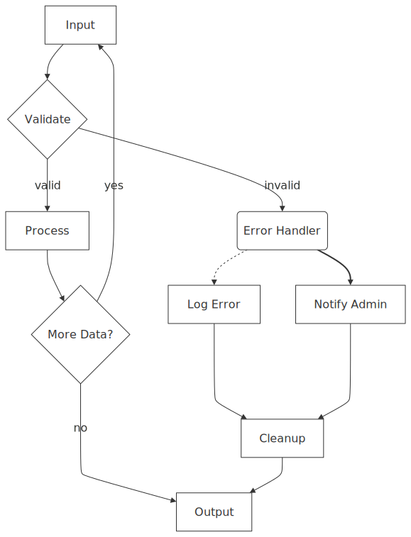

</details>

<details>
<summary>Mermaid source</summary>

```
graph TD
    %% Complex diagram with multiple features
    A[Input] --> B{Validate}
    B -->|valid| C[Process]
    B -->|invalid| D(Error Handler)
    C --> E{More Data?}
    E -->|yes| A
    E -->|no| F[Output]
    D -.-> G[Log Error]
    D ==> H[Notify Admin]
    G & H --> I[Cleanup]
    I --> F

```

</details>

## cross_circle_arrows

`tests/fixtures/flowchart/cross_circle_arrows.mmd`

> Missing text snapshot: `tests/snapshots/flowchart/cross_circle_arrows.txt`

<details>
<summary>SVG output</summary>

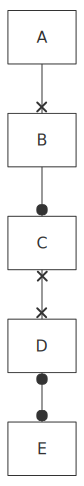

</details>

<details>
<summary>Mermaid source</summary>

```
graph TD
    A --x B
    B --o C
    C x--x D
    D o--o E

```

</details>

## crossing_minimize

`tests/fixtures/flowchart/crossing_minimize.mmd`

> Missing text snapshot: `tests/snapshots/flowchart/crossing_minimize.txt`

<details>
<summary>SVG output</summary>

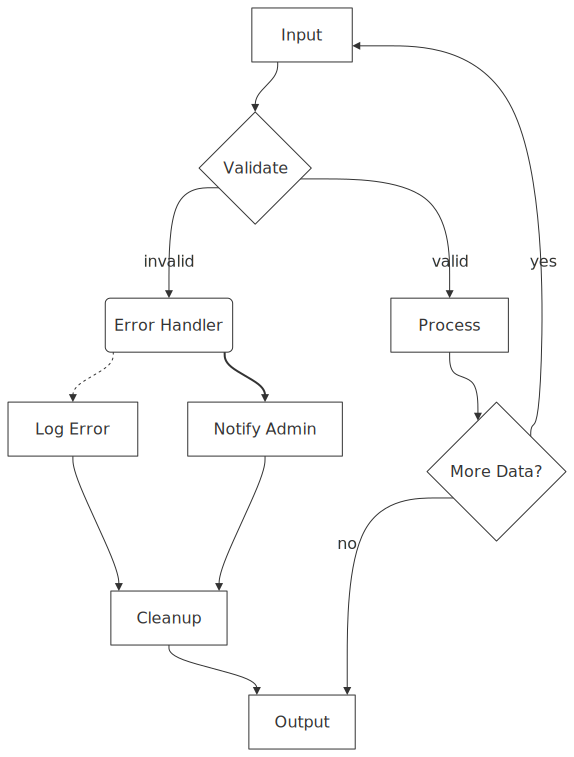

</details>

<details>
<summary>Mermaid source</summary>

```
flowchart TB
    A["Input"] --> B{"Validate"}
    B -- valid --> C["Process"]
    B -- invalid --> D("Error Handler")
    C --> E{"More Data?"}
    E -- yes --> A
    D -.-> G["Log Error"]
    D ==> H["Notify Admin"]
    G --> I["Cleanup"]
    H --> I
    I --> F["Output"]
    E -- no --> F

```

</details>

## decision

`tests/fixtures/flowchart/decision.mmd`

> Missing text snapshot: `tests/snapshots/flowchart/decision.txt`

<details>
<summary>SVG output</summary>

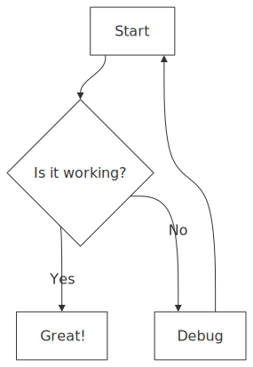

</details>

<details>
<summary>Mermaid source</summary>

```
graph TD
    A[Start] --> B{Is it working?}
    B -->|Yes| C[Great!]
    B -->|No| D[Debug]
    D --> A

```

</details>

## diamond_backward

`tests/fixtures/flowchart/diamond_backward.mmd`

> Missing text snapshot: `tests/snapshots/flowchart/diamond_backward.txt`

<details>
<summary>SVG output</summary>

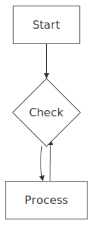

</details>

<details>
<summary>Mermaid source</summary>

```
graph TD
    A[Start] --> B{Check}
    B --> C[Process]
    C --> B

```

</details>

## diamond_fan

`tests/fixtures/flowchart/diamond_fan.mmd`

> Missing text snapshot: `tests/snapshots/flowchart/diamond_fan.txt`

<details>
<summary>SVG output</summary>


</details>

<details>
<summary>Mermaid source</summary>

```
graph TD
    A[Start] --> B[Left]
    A --> C[Right]
    B --> D[End]
    C --> D

```

</details>

## diamond_fan_out

`tests/fixtures/flowchart/diamond_fan_out.mmd`

> Missing text snapshot: `tests/snapshots/flowchart/diamond_fan_out.txt`

<details>
<summary>SVG output</summary>

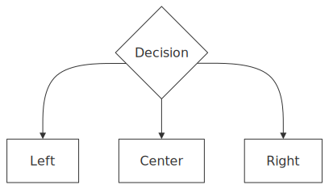

</details>

<details>
<summary>Mermaid source</summary>

```
graph TD
    A{Decision} --> B[Left]
    A --> C[Center]
    A --> D[Right]

```

</details>

## direction_override

`tests/fixtures/flowchart/direction_override.mmd`

> Missing text snapshot: `tests/snapshots/flowchart/direction_override.txt`

<details>
<summary>SVG output</summary>

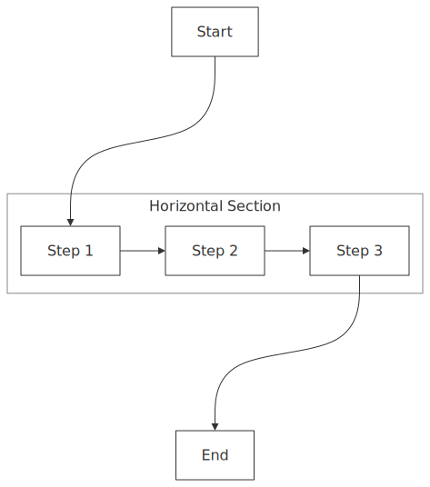

</details>

<details>
<summary>Mermaid source</summary>

```
graph TD
    subgraph sg1[Horizontal Section]
        direction LR
        A[Step 1] --> B[Step 2] --> C[Step 3]
    end
    Start --> A
    C --> End

```

</details>

## double_skip

`tests/fixtures/flowchart/double_skip.mmd`

> Missing text snapshot: `tests/snapshots/flowchart/double_skip.txt`

<details>
<summary>SVG output</summary>

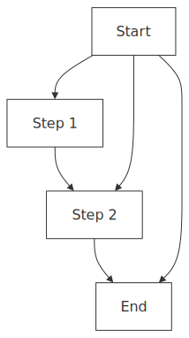

</details>

<details>
<summary>Mermaid source</summary>

```
graph TD
    A[Start] --> B[Step 1]
    B --> C[Step 2]
    C --> D[End]
    A --> C
    A --> D

```

</details>

## edge_styles

`tests/fixtures/flowchart/edge_styles.mmd`

> Missing text snapshot: `tests/snapshots/flowchart/edge_styles.txt`

<details>
<summary>SVG output</summary>

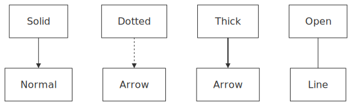

</details>

<details>
<summary>Mermaid source</summary>

```
graph TD
    A[Solid] --> B[Normal]
    C[Dotted] -.-> D[Arrow]
    E[Thick] ==> F[Arrow]
    G[Open] --- H[Line]

```

</details>

## external_node_subgraph

`tests/fixtures/flowchart/external_node_subgraph.mmd`

> Missing text snapshot: `tests/snapshots/flowchart/external_node_subgraph.txt`

<details>
<summary>SVG output</summary>

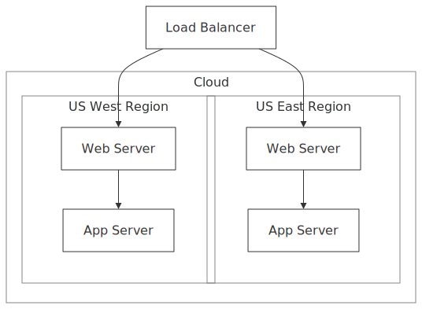

</details>

<details>
<summary>Mermaid source</summary>

```
graph TD
  subgraph Cloud
    subgraph us-east [US East Region]
      A[Web Server] --> B[App Server]
    end
    subgraph us-west [US West Region]
      C[Web Server] --> D[App Server]
    end
  end
  E[Load Balancer] --> A
  E --> C

```

</details>

## fan_in_backward_channel_conflict

`tests/fixtures/flowchart/fan_in_backward_channel_conflict.mmd`

> Missing text snapshot: `tests/snapshots/flowchart/fan_in_backward_channel_conflict.txt`

<details>
<summary>SVG output</summary>

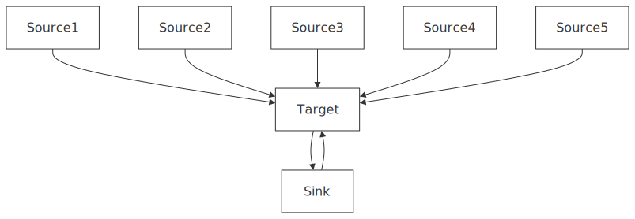

</details>

<details>
<summary>Mermaid source</summary>

```
graph TD
    P1[Source1] --> B[Target]
    P2[Source2] --> B
    P3[Source3] --> B
    P4[Source4] --> B
    P5[Source5] --> B
    B --> Loop[Sink]
    Loop --> B

```

</details>

## fan_in_lr

`tests/fixtures/flowchart/fan_in_lr.mmd`

> Missing text snapshot: `tests/snapshots/flowchart/fan_in_lr.txt`

<details>
<summary>SVG output</summary>

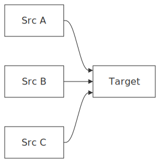

</details>

<details>
<summary>Mermaid source</summary>

```
graph LR
    A[Src A] --> D[Target]
    B[Src B] --> D
    C[Src C] --> D

```

</details>

## fan_in

`tests/fixtures/flowchart/fan_in.mmd`

> Missing text snapshot: `tests/snapshots/flowchart/fan_in.txt`

<details>
<summary>SVG output</summary>

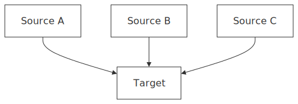

</details>

<details>
<summary>Mermaid source</summary>

```
graph TD
    A[Source A] --> D[Target]
    B[Source B] --> D
    C[Source C] --> D

```

</details>

## fan_out

`tests/fixtures/flowchart/fan_out.mmd`

> Missing text snapshot: `tests/snapshots/flowchart/fan_out.txt`

<details>
<summary>SVG output</summary>

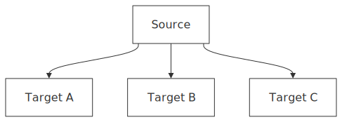

</details>

<details>
<summary>Mermaid source</summary>

```
graph TD
    A[Source] --> B[Target A]
    A --> C[Target B]
    A --> D[Target C]

```

</details>

## five_fan_in_diamond

`tests/fixtures/flowchart/five_fan_in_diamond.mmd`

> Missing text snapshot: `tests/snapshots/flowchart/five_fan_in_diamond.txt`

<details>
<summary>SVG output</summary>

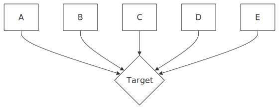

</details>

<details>
<summary>Mermaid source</summary>

```
graph TD
    A[A] --> F{Target}
    B[B] --> F
    C[C] --> F
    D[D] --> F
    E[E] --> F

```

</details>

## five_fan_in_lr

`tests/fixtures/flowchart/five_fan_in_lr.mmd`

> Missing text snapshot: `tests/snapshots/flowchart/five_fan_in_lr.txt`

<details>
<summary>SVG output</summary>

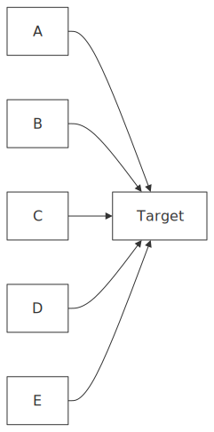

</details>

<details>
<summary>Mermaid source</summary>

```
graph LR
    A[A] --> F[Target]
    B[B] --> F
    C[C] --> F
    D[D] --> F
    E[E] --> F

```

</details>

## five_fan_in

`tests/fixtures/flowchart/five_fan_in.mmd`

> Missing text snapshot: `tests/snapshots/flowchart/five_fan_in.txt`

<details>
<summary>SVG output</summary>

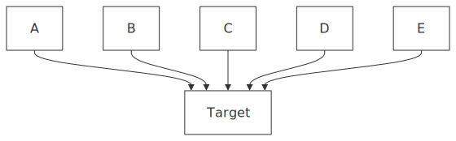

</details>

<details>
<summary>Mermaid source</summary>

```
graph TD
    A[A] --> F[Target]
    B[B] --> F
    C[C] --> F
    D[D] --> F
    E[E] --> F

```

</details>

## five_fan_out_diamond

`tests/fixtures/flowchart/five_fan_out_diamond.mmd`

> Missing text snapshot: `tests/snapshots/flowchart/five_fan_out_diamond.txt`

<details>
<summary>SVG output</summary>

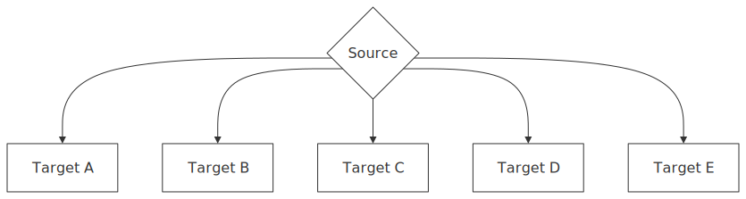

</details>

<details>
<summary>Mermaid source</summary>

```
graph TD
      A{Source} --> B[Target A]
      A --> C[Target B]
      A --> D[Target C]
      A --> E[Target D]
      A --> F[Target E]
```

</details>

## five_fan_out_lr

`tests/fixtures/flowchart/five_fan_out_lr.mmd`

> Missing text snapshot: `tests/snapshots/flowchart/five_fan_out_lr.txt`

<details>
<summary>SVG output</summary>

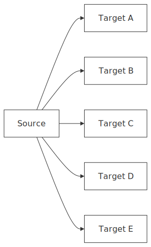

</details>

<details>
<summary>Mermaid source</summary>

```
graph LR
      A[Source] --> B[Target A]
      A --> C[Target B]
      A --> D[Target C]
      A --> E[Target D]
      A --> F[Target E]

```

</details>

## five_fan_out

`tests/fixtures/flowchart/five_fan_out.mmd`

> Missing text snapshot: `tests/snapshots/flowchart/five_fan_out.txt`

<details>
<summary>SVG output</summary>

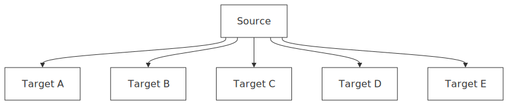

</details>

<details>
<summary>Mermaid source</summary>

```
graph TD
      A[Source] --> B[Target A]
      A --> C[Target B]
      A --> D[Target C]
      A --> E[Target D]
      A --> F[Target E]
```

</details>

## flowchart_code_flow

`tests/fixtures/flowchart/flowchart_code_flow.mmd`

> Missing text snapshot: `tests/snapshots/flowchart/flowchart_code_flow.txt`

<details>
<summary>SVG output</summary>

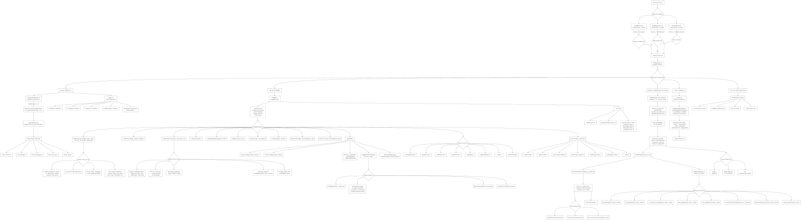

</details>

<details>
<summary>Mermaid source</summary>

```
---
references:
  - "File: /packages/mermaid/src/diagrams/flowchart/flowDiagram.ts"
  - "File: /packages/mermaid/src/diagrams/flowchart/flowDb.ts"
  - "File: /packages/mermaid/src/diagrams/flowchart/flowDetector.ts"
  - "File: /packages/mermaid/src/diagrams/flowchart/flowDetector-v2.ts"
  - "File: /packages/mermaid/src/diagrams/flowchart/flowRenderer-v3-unified.ts"
  - "File: /packages/mermaid/src/diagrams/flowchart/styles.ts"
  - "File: /packages/mermaid/src/diagrams/flowchart/types.ts"
  - "File: /packages/mermaid/src/diagrams/flowchart/flowChartShapes.js"
  - "File: /packages/mermaid/src/diagrams/flowchart/parser/flowParser.ts"
  - "File: /packages/mermaid/src/diagrams/flowchart/elk/detector.ts"
generationTime: 2025-07-23T10:31:53.266Z
---
flowchart TD
    %% Entry Points and Detection
    Input["User Input Text"] --> Detection{Detection Phase}
    
    Detection --> flowDetector["flowDetector.ts<br/>detector(txt, config)"]
    Detection --> flowDetectorV2["flowDetector-v2.ts<br/>detector(txt, config)"]
    Detection --> elkDetector["elk/detector.ts<br/>detector(txt, config)"]
    
    flowDetector --> |"Checks /^\s*graph/"| DetectLegacy{Legacy Flowchart?}
    flowDetectorV2 --> |"Checks /^\s*flowchart/"| DetectNew{New Flowchart?}
    elkDetector --> |"Checks /^\s*flowchart-elk/"| DetectElk{ELK Layout?}
    
    DetectLegacy --> |Yes| LoadDiagram
    DetectNew --> |Yes| LoadDiagram
    DetectElk --> |Yes| LoadDiagram
    
    %% Loading Phase
    LoadDiagram["loader() function"] --> flowDiagram["flowDiagram.ts<br/>diagram object"]
    
    flowDiagram --> DiagramStructure{Diagram Components}
    DiagramStructure --> Parser["parser: flowParser"]
    DiagramStructure --> Database["db: new FlowDB()"]
    DiagramStructure --> Renderer["renderer: flowRenderer-v3-unified"]
    DiagramStructure --> Styles["styles: flowStyles"]
    DiagramStructure --> Init["init: (cnf: MermaidConfig)"]
    
    %% Parser Phase
    Parser --> flowParser["parser/flowParser.ts<br/>newParser.parse(src)"]
    flowParser --> |"Preprocesses src"| RemoveWhitespace["Remove trailing whitespace<br/>src.replace(/}\s*\n/g, '}\n')"]
    RemoveWhitespace --> flowJison["parser/flow.jison<br/>flowJisonParser.parse(newSrc)"]
    
    flowJison --> ParseGraph["Parse Graph Structure"]
    ParseGraph --> ParseVertices["Parse Vertices"]
    ParseGraph --> ParseEdges["Parse Edges"]
    ParseGraph --> ParseSubgraphs["Parse Subgraphs"]
    ParseGraph --> ParseClasses["Parse Classes"]
    ParseGraph --> ParseStyles["Parse Styles"]
    
    %% Database Phase - FlowDB Class
    Database --> FlowDBClass["flowDb.ts<br/>FlowDB class"]
    
    FlowDBClass --> DBInit["constructor()<br/>- Initialize counters<br/>- Bind methods<br/>- Setup toolTips<br/>- Call clear()"]
    
    DBInit --> DBMethods{FlowDB Methods}
    
    DBMethods --> addVertex["addVertex(id, textObj, type, style,<br/>classes, dir, props, metadata)"]
    DBMethods --> addLink["addLink(_start[], _end[], linkData)"]
    DBMethods --> addSingleLink["addSingleLink(_start, _end, type, id)"]
    DBMethods --> setDirection["setDirection(dir)"]
    DBMethods --> addSubGraph["addSubGraph(nodes[], id, title)"]
    DBMethods --> addClass["addClass(id, style)"]
    DBMethods --> setClass["setClass(ids, className)"]
    DBMethods --> setTooltip["setTooltip(ids, tooltip)"]
    DBMethods --> setClickEvent["setClickEvent(id, functionName, args)"]
    DBMethods --> setClickFun["setClickFun(id, functionName, args)"]
    
    %% Vertex Processing
    addVertex --> VertexProcess{Vertex Processing}
    VertexProcess --> CreateVertex["Create FlowVertex object<br/>- id, labelType, domId<br/>- styles[], classes[]"]
    VertexProcess --> SanitizeText["sanitizeText(textObj.text)"]
    VertexProcess --> ParseMetadata["Parse YAML metadata<br/>yaml.load(yamlData)"]
    VertexProcess --> SetVertexProps["Set vertex properties<br/>- shape, label, icon, form<br/>- pos, img, constraint, w, h"]
    
    %% Edge Processing  
    addSingleLink --> EdgeProcess{Edge Processing}
    EdgeProcess --> CreateEdge["Create FlowEdge object<br/>- start, end, type, text<br/>- labelType, classes[]"]
    EdgeProcess --> ProcessLinkText["Process link text<br/>- sanitizeText()<br/>- strip quotes"]
    EdgeProcess --> SetEdgeProps["Set edge properties<br/>- type, stroke, length"]
    EdgeProcess --> GenerateEdgeId["Generate edge ID<br/>getEdgeId(start, end, counter)"]
    EdgeProcess --> ValidateEdgeLimit["Validate edge limit<br/>maxEdges check"]
    
    %% Data Collection
    DBMethods --> GetData["getData()"]
    GetData --> CollectNodes["Collect nodes[] from vertices"]
    GetData --> CollectEdges["Collect edges[] from edges"]
    GetData --> ProcessSubGraphs["Process subgraphs<br/>- parentDB Map<br/>- subGraphDB Map"]
    GetData --> AddNodeFromVertex["addNodeFromVertex()<br/>for each vertex"]
    GetData --> ProcessEdgeTypes["destructEdgeType()<br/>arrowTypeStart, arrowTypeEnd"]
    
    %% Node Creation
    AddNodeFromVertex --> NodeCreation{Node Creation}
    NodeCreation --> FindExistingNode["findNode(nodes, vertex.id)"]
    NodeCreation --> CreateBaseNode["Create base node<br/>- id, label, parentId<br/>- cssStyles, cssClasses<br/>- shape, domId, tooltip"]
    NodeCreation --> GetCompiledStyles["getCompiledStyles(classDefs)"]
    NodeCreation --> GetTypeFromVertex["getTypeFromVertex(vertex)"]
    
    %% Rendering Phase
    Renderer --> flowRendererV3["flowRenderer-v3-unified.ts<br/>draw(text, id, version, diag)"]
    
    flowRendererV3 --> RenderInit["Initialize rendering<br/>- getConfig()<br/>- handle securityLevel<br/>- getDiagramElement()"]
    
    RenderInit --> GetLayoutData["diag.db.getData()<br/>as LayoutData"]
    GetLayoutData --> SetupLayoutData["Setup layout data<br/>- type, layoutAlgorithm<br/>- direction, spacing<br/>- markers, diagramId"]
    
    SetupLayoutData --> CallRender["render(data4Layout, svg)"]
    CallRender --> SetupViewPort["setupViewPortForSVG(svg, padding)"]
    SetupViewPort --> ProcessLinks["Process vertex links<br/>- create anchor elements<br/>- handle click events"]
    
    %% Shape Rendering
    CallRender --> ShapeSystem["flowChartShapes.js<br/>Shape Functions"]
    
    ShapeSystem --> ShapeFunctions{Shape Functions}
    ShapeFunctions --> question["question(parent, bbox, node)"]
    ShapeFunctions --> hexagon["hexagon(parent, bbox, node)"]
    ShapeFunctions --> rect_left_inv_arrow["rect_left_inv_arrow(parent, bbox, node)"]
    ShapeFunctions --> lean_right["lean_right(parent, bbox, node)"]
    ShapeFunctions --> lean_left["lean_left(parent, bbox, node)"]
    
    ShapeFunctions --> insertPolygonShape["insertPolygonShape(parent, w, h, points)"]
    ShapeFunctions --> intersectPolygon["intersectPolygon(node, points, point)"]
    ShapeFunctions --> intersectRect["intersectRect(node, point)"]
    
    %% Styling System
    Styles --> stylesTS["styles.ts<br/>getStyles(options)"]
    stylesTS --> StyleOptions["FlowChartStyleOptions<br/>- arrowheadColor, border2<br/>- clusterBkg, mainBkg<br/>- fontFamily, textColor"]
    
    StyleOptions --> GenerateCSS["Generate CSS styles<br/>- .label, .cluster-label<br/>- .node, .edgePath<br/>- .flowchart-link, .edgeLabel"]
    GenerateCSS --> GetIconStyles["getIconStyles()"]
    
    %% Type System
    Parser --> TypeSystem["types.ts<br/>Type Definitions"]
    TypeSystem --> FlowVertex["FlowVertex interface"]
    TypeSystem --> FlowEdge["FlowEdge interface"]
    TypeSystem --> FlowClass["FlowClass interface"]
    TypeSystem --> FlowSubGraph["FlowSubGraph interface"]
    TypeSystem --> FlowVertexTypeParam["FlowVertexTypeParam<br/>Shape types"]
    
    %% Utility Functions
    DBMethods --> UtilityFunctions{Utility Functions}
    UtilityFunctions --> lookUpDomId["lookUpDomId(id)"]
    UtilityFunctions --> getClasses["getClasses()"]
    UtilityFunctions --> getDirection["getDirection()"]
    UtilityFunctions --> getVertices["getVertices()"]
    UtilityFunctions --> getEdges["getEdges()"]
    UtilityFunctions --> getSubGraphs["getSubGraphs()"]
    UtilityFunctions --> clear["clear()"]
    UtilityFunctions --> defaultConfig["defaultConfig()"]
    
    %% Event Handling
    ProcessLinks --> EventHandling{Event Handling}
    EventHandling --> setupToolTips["setupToolTips(element)"]
    EventHandling --> bindFunctions["bindFunctions(element)"]
    EventHandling --> runFunc["utils.runFunc(functionName, args)"]
    
    %% Common Database Functions
    DBMethods --> CommonDB["commonDb.js functions"]
    CommonDB --> setAccTitle["setAccTitle()"]
    CommonDB --> getAccTitle["getAccTitle()"]
    CommonDB --> setAccDescription["setAccDescription()"]
    CommonDB --> getAccDescription["getAccDescription()"]
    CommonDB --> setDiagramTitle["setDiagramTitle()"]
    CommonDB --> getDiagramTitle["getDiagramTitle()"]
    CommonDB --> commonClear["clear()"]
    
    %% Final Output
    ProcessLinks --> FinalSVG["Final SVG Output"]
    
    %% Layout Algorithm Selection
    SetupLayoutData --> LayoutAlgorithm{Layout Algorithm}
    LayoutAlgorithm --> Dagre["dagre<br/>(default)"]
    LayoutAlgorithm --> DagreWrapper["dagre-wrapper<br/>(v2 renderer)"]
    LayoutAlgorithm --> ELK["elk<br/>(external package)"]
    
    %% Testing Components
    FlowDBClass --> TestFiles["Test Files"]
    TestFiles --> flowDbSpec["flowDb.spec.ts"]
    TestFiles --> flowChartShapesSpec["flowChartShapes.spec.js"]
    TestFiles --> ParserTests["parser/*.spec.js files<br/>- flow-text.spec.js<br/>- flow-edges.spec.js<br/>- flow-style.spec.js<br/>- subgraph.spec.js"]
    
    %% Configuration
    Init --> ConfigSetup["Configuration Setup"]
    ConfigSetup --> FlowchartConfig["cnf.flowchart config"]
    ConfigSetup --> ArrowMarkers["arrowMarkerAbsolute"]
    ConfigSetup --> LayoutConfig["layout config"]
    ConfigSetup --> SetConfig["setConfig() calls"]
```

</details>

## git_workflow

`tests/fixtures/flowchart/git_workflow.mmd`

> Missing text snapshot: `tests/snapshots/flowchart/git_workflow.txt`

<details>
<summary>SVG output</summary>


</details>

<details>
<summary>Mermaid source</summary>

```
graph LR
    %% A typical git workflow
    Working[Working Dir] -->|git add| Staging[Staging Area]
    Staging -->|git commit| Local[Local Repo]
    Local -->|git push| Remote[Remote Repo]
    Remote -->|git pull| Working

```

</details>

## git_workflow_td

`tests/fixtures/flowchart/git_workflow_td.mmd`

> Missing text snapshot: `tests/snapshots/flowchart/git_workflow_td.txt`

<details>
<summary>SVG output</summary>

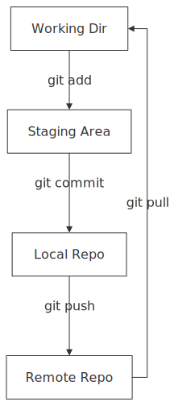

</details>

<details>
<summary>Mermaid source</summary>

```
graph TD
    %% A typical git workflow
    Working[Working Dir] -->|git add| Staging[Staging Area]
    Staging -->|git commit| Local[Local Repo]
    Local -->|git push| Remote[Remote Repo]
    Remote -->|git pull| Working

```

</details>

## hexagon_flow

`tests/fixtures/flowchart/hexagon_flow.mmd`

> Missing text snapshot: `tests/snapshots/flowchart/hexagon_flow.txt`

<details>
<summary>SVG output</summary>

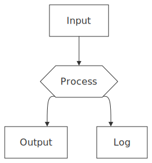

</details>

<details>
<summary>Mermaid source</summary>

```
graph TD
    A{{Process}} --> B[Output]
    C[Input] --> A
    A --> D[Log]

```

</details>

## http_request

`tests/fixtures/flowchart/http_request.mmd`

> Missing text snapshot: `tests/snapshots/flowchart/http_request.txt`

<details>
<summary>SVG output</summary>

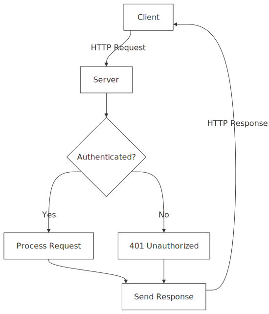

</details>

<details>
<summary>Mermaid source</summary>

```
graph TD
    Client[Client] -->|HTTP Request| Server[Server]
    Server --> Auth{Authenticated?}
    Auth -->|Yes| Process[Process Request]
    Auth -->|No| Reject[401 Unauthorized]
    Process --> Response[Send Response]
    Reject --> Response
    Response -->|HTTP Response| Client

```

</details>

## inline_edge_labels

`tests/fixtures/flowchart/inline_edge_labels.mmd`

> Missing text snapshot: `tests/snapshots/flowchart/inline_edge_labels.txt`

<details>
<summary>SVG output</summary>

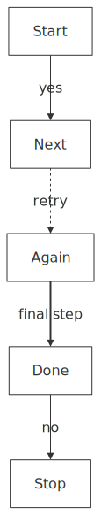

</details>

<details>
<summary>Mermaid source</summary>

```
graph TD
    A[Start] -- yes --> B[Next]
    B -. retry .-> C[Again]
    C == "final step" ==> D[Done]
    D -- no --> E[Stop]

```

</details>

## inline_label_flowchart

`tests/fixtures/flowchart/inline_label_flowchart.mmd`

> Missing text snapshot: `tests/snapshots/flowchart/inline_label_flowchart.txt`

<details>
<summary>SVG output</summary>


</details>

<details>
<summary>Mermaid source</summary>

```
flowchart TD
  start((Start)) --> ingest[Ingest Request]
  ingest --> parse[Parse Payload]
  parse --> validate{Valid?}

  validate -- no --> reject[Reject]
  reject -.-> notify[Notify User]
  reject --> metrics[Emit Metrics]

  validate -- yes --> route{Route Type}
  route -- sync --> sync[Sync Pipeline]
  route -- async --> queue[Enqueue Job]

  queue --> worker[Worker Pool]
  worker --> process[Process Job]
  process --> success{Success?}

  success -- no --> retry[Retry]
  retry ==> queue

  success -- yes --> persist[Persist Result]
  sync --> persist
  persist --> metrics

  parse --> cache[Lookup Cache]
  cache -- hit --> fastpath[Serve Cached]
  fastpath --> metrics
  cache -- miss --> validate

  ingest --> audit[Audit Log]
  audit --> metrics

  process -- warn --> alert[Page On-call]
  alert -.-> metrics

  metrics --> End((Done))

```

</details>

## labeled_edges

`tests/fixtures/flowchart/labeled_edges.mmd`

> Missing text snapshot: `tests/snapshots/flowchart/labeled_edges.txt`

<details>
<summary>SVG output</summary>

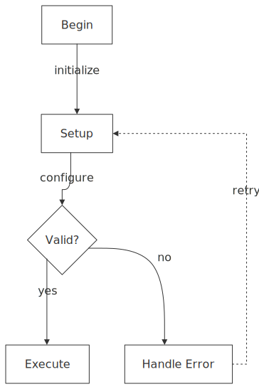

</details>

<details>
<summary>Mermaid source</summary>

```
graph TD
    Start[Begin] -->|initialize| Setup[Setup]
    Setup -->|configure| Config{Valid?}
    Config -->|yes| Run[Execute]
    Config -->|no| Error[Handle Error]
    Error -.->|retry| Setup

```

</details>

## label_spacing

`tests/fixtures/flowchart/label_spacing.mmd`

> Missing text snapshot: `tests/snapshots/flowchart/label_spacing.txt`

<details>
<summary>SVG output</summary>

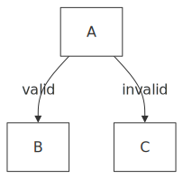

</details>

<details>
<summary>Mermaid source</summary>

```
graph TD
    %% Test case for edge label spacing with branching edges
    %% Labels should not overlap when multiple edges branch from the same source
    A -->|valid| B
    A -->|invalid| C

```

</details>

## left_right

`tests/fixtures/flowchart/left_right.mmd`

> Missing text snapshot: `tests/snapshots/flowchart/left_right.txt`

<details>
<summary>SVG output</summary>


</details>

<details>
<summary>Mermaid source</summary>

```
graph LR
    Input[User Input] --> Process[Process Data]
    Process --> Output[Display Result]

```

</details>

## mixed_shape_chain

`tests/fixtures/flowchart/mixed_shape_chain.mmd`

> Missing text snapshot: `tests/snapshots/flowchart/mixed_shape_chain.txt`

<details>
<summary>SVG output</summary>

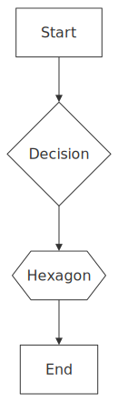

</details>

<details>
<summary>Mermaid source</summary>

```
graph TD
    A[Start] --> B{Decision}
    B --> C{{Hexagon}}
    C --> D[End]

```

</details>

## multi_edge_labeled

`tests/fixtures/flowchart/multi_edge_labeled.mmd`

> Missing text snapshot: `tests/snapshots/flowchart/multi_edge_labeled.txt`

<details>
<summary>SVG output</summary>

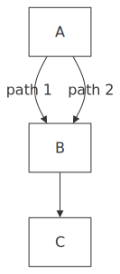

</details>

<details>
<summary>Mermaid source</summary>

```
graph TD
    A -->|path 1| B
    A -->|path 2| B
    B --> C

```

</details>

## multi_edge

`tests/fixtures/flowchart/multi_edge.mmd`

> Missing text snapshot: `tests/snapshots/flowchart/multi_edge.txt`

<details>
<summary>SVG output</summary>

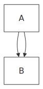

</details>

<details>
<summary>Mermaid source</summary>

```
graph TD
    A --> B
    A --> B

```

</details>

## multiple_cycles

`tests/fixtures/flowchart/multiple_cycles.mmd`

> Missing text snapshot: `tests/snapshots/flowchart/multiple_cycles.txt`

<details>
<summary>SVG output</summary>


</details>

<details>
<summary>Mermaid source</summary>

```
graph TD
    A[Top] --> B[Middle]
    B --> C[Bottom]
    C --> A
    C --> B

```

</details>

## multi_subgraph_direction_override

`tests/fixtures/flowchart/multi_subgraph_direction_override.mmd`

> Missing text snapshot: `tests/snapshots/flowchart/multi_subgraph_direction_override.txt`

<details>
<summary>SVG output</summary>

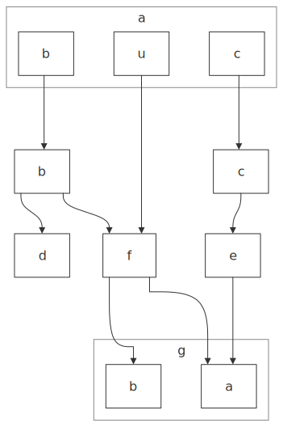

</details>

<details>
<summary>Mermaid source</summary>

```
flowchart TB

%% --- Top container (A) ---
subgraph A["a"]
  direction LR
  Ab["b"]
  Au["u"]
  Ac["c"]
end
 
%% --- Middle (outside containers) ---
Bmid["b"]
D["d"]
F["f"]

Cmid["c"]
E["e"]

%% --- Bottom container (G) ---
subgraph G["g"]
  direction LR
  Gb["b"]
  Ga["a"]
end

%% --- Edges (match the figure) ---
Ab --> Bmid
Bmid --> D
Bmid --> F
Au --> F

Ac --> Cmid
Cmid --> E

F --> Gb
F --> Ga
E --> Ga

%% --- Light styling to resemble container shading (optional) ---
style A fill:#e9efff,stroke:#1f4fff,stroke-width:1px
style G fill:#e9efff,stroke:#1f4fff,stroke-width:1px
classDef node fill:#f7f9ff,stroke:#1f4fff,stroke-width:1px,color:#000
class Ab,Au,Ac,Bmid,Cmid,D,E,F,Gb,Ga node
```

</details>

## multi_subgraph

`tests/fixtures/flowchart/multi_subgraph.mmd`

> Missing text snapshot: `tests/snapshots/flowchart/multi_subgraph.txt`

<details>
<summary>SVG output</summary>

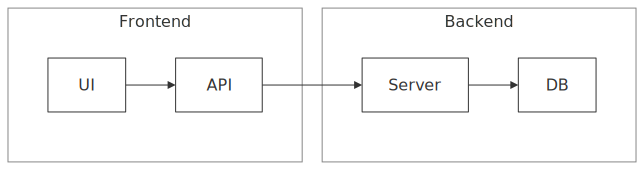

</details>

<details>
<summary>Mermaid source</summary>

```
graph LR
subgraph sg1[Frontend]
A[UI] --> B[API]
end
subgraph sg2[Backend]
C[Server] --> D[DB]
end
B --> C

```

</details>

## narrow_fan_in

`tests/fixtures/flowchart/narrow_fan_in.mmd`

> Missing text snapshot: `tests/snapshots/flowchart/narrow_fan_in.txt`

<details>
<summary>SVG output</summary>

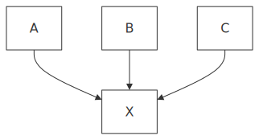

</details>

<details>
<summary>Mermaid source</summary>

```
graph TD
    A[A] --> D[X]
    B[B] --> D
    C[C] --> D

```

</details>

## nested_subgraph_edge

`tests/fixtures/flowchart/nested_subgraph_edge.mmd`

> Missing text snapshot: `tests/snapshots/flowchart/nested_subgraph_edge.txt`

<details>
<summary>SVG output</summary>

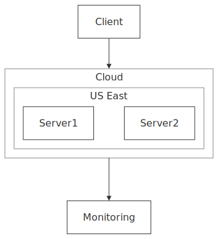

</details>

<details>
<summary>Mermaid source</summary>

```
graph TD
    subgraph cloud[Cloud]
        subgraph region[US East]
            Server1
            Server2
        end
    end
    Client --> cloud
    cloud --> Monitoring

```

</details>

## nested_subgraph

`tests/fixtures/flowchart/nested_subgraph.mmd`

> Missing text snapshot: `tests/snapshots/flowchart/nested_subgraph.txt`

<details>
<summary>SVG output</summary>

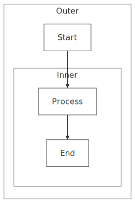

</details>

<details>
<summary>Mermaid source</summary>

```
graph TD
subgraph outer[Outer]
A[Start]
subgraph inner[Inner]
B[Process] --> C[End]
end
end
A --> B

```

</details>

## nested_subgraph_only

`tests/fixtures/flowchart/nested_subgraph_only.mmd`

> Missing text snapshot: `tests/snapshots/flowchart/nested_subgraph_only.txt`

<details>
<summary>SVG output</summary>


</details>

<details>
<summary>Mermaid source</summary>

```
graph TD
subgraph outer[Outer]
subgraph inner[Inner]
A --> B
end
end

```

</details>

## nested_with_siblings

`tests/fixtures/flowchart/nested_with_siblings.mmd`

> Missing text snapshot: `tests/snapshots/flowchart/nested_with_siblings.txt`

<details>
<summary>SVG output</summary>


</details>

<details>
<summary>Mermaid source</summary>

```
graph LR
subgraph outer[Outer]
subgraph left[Left]
A --> B
end
subgraph right[Right]
C --> D
end
end
B --> C

```

</details>

## right_left

`tests/fixtures/flowchart/right_left.mmd`

> Missing text snapshot: `tests/snapshots/flowchart/right_left.txt`

<details>
<summary>SVG output</summary>


</details>

<details>
<summary>Mermaid source</summary>

```
graph RL
    End[Finish] --> Middle[Process]
    Middle --> Start[Begin]

```

</details>

## self_loop_labeled

`tests/fixtures/flowchart/self_loop_labeled.mmd`

> Missing text snapshot: `tests/snapshots/flowchart/self_loop_labeled.txt`

<details>
<summary>SVG output</summary>


</details>

<details>
<summary>Mermaid source</summary>

```
graph TD
    A[Start] --> B{Retry?}
    B -->|retry| B
    B -->|done| C[End]

```

</details>

## self_loop

`tests/fixtures/flowchart/self_loop.mmd`

> Missing text snapshot: `tests/snapshots/flowchart/self_loop.txt`

<details>
<summary>SVG output</summary>


</details>

<details>
<summary>Mermaid source</summary>

```
graph TD
    A[Process] --> A

```

</details>

## self_loop_with_others

`tests/fixtures/flowchart/self_loop_with_others.mmd`

> Missing text snapshot: `tests/snapshots/flowchart/self_loop_with_others.txt`

<details>
<summary>SVG output</summary>


</details>

<details>
<summary>Mermaid source</summary>

```
graph TD
    A[Start] --> B[Process]
    B --> B
    B --> C[End]

```

</details>

## shapes_basic

`tests/fixtures/flowchart/shapes_basic.mmd`

> Missing text snapshot: `tests/snapshots/flowchart/shapes_basic.txt`

<details>
<summary>SVG output</summary>


</details>

<details>
<summary>Mermaid source</summary>

```
graph TD
    rect[Rectangle]
    round(Rounded)
    stadium([Stadium])
    sub[[Subroutine]]
    cyl[(Cylinder)]
    diamond{Decision}
    hex{{Hexagon}}
    rect --> round --> stadium --> sub --> cyl --> diamond --> hex

```

</details>

## shapes_degenerate

`tests/fixtures/flowchart/shapes_degenerate.mmd`

> Missing text snapshot: `tests/snapshots/flowchart/shapes_degenerate.txt`

<details>
<summary>SVG output</summary>


</details>

<details>
<summary>Mermaid source</summary>

```
graph TD
    cloud@{shape: cloud, label: "Cloud"}
    bolt@{shape: bolt, label: "Bolt"}
    bang@{shape: bang, label: "Bang"}
    icon@{shape: icon, label: "Icon"}
    hourglass@{shape: hourglass, label: "Hour"}
    tri@{shape: tri, label: "Tri"}
    flip@{shape: flip-tri, label: "Flip"}
    notch@{shape: notch-pent, label: "Notch"}
    cloud --> bolt --> bang --> icon --> hourglass --> tri --> flip --> notch

```

</details>

## shapes_document

`tests/fixtures/flowchart/shapes_document.mmd`

> Missing text snapshot: `tests/snapshots/flowchart/shapes_document.txt`

<details>
<summary>SVG output</summary>


</details>

<details>
<summary>Mermaid source</summary>

```
graph TD
    doc@{shape: doc, label: "Doc"}
    docs@{shape: docs, label: "Docs"}
    tagdoc@{shape: tag-doc, label: "TagDoc"}
    card@{shape: card, label: "Card"}
    tag@{shape: tag-rect, label: "Tag"}
    doc --> docs --> tagdoc --> card --> tag

```

</details>

## shapes_junction

`tests/fixtures/flowchart/shapes_junction.mmd`

> Missing text snapshot: `tests/snapshots/flowchart/shapes_junction.txt`

<details>
<summary>SVG output</summary>


</details>

<details>
<summary>Mermaid source</summary>

```
graph LR
    j1@{shape: sm-circ}
    j2@{shape: fr-circ}
    j3@{shape: cross-circ}
    j1 --> j2 --> j3

```

</details>

## shapes

`tests/fixtures/flowchart/shapes.mmd`

> Missing text snapshot: `tests/snapshots/flowchart/shapes.txt`

<details>
<summary>SVG output</summary>


</details>

<details>
<summary>Mermaid source</summary>

```
graph TD
    rect[Rectangle Node]
    round(Rounded Node)
    diamond{Diamond Node}
    rect --> round --> diamond

```

</details>

## shapes_special

`tests/fixtures/flowchart/shapes_special.mmd`

> Missing text snapshot: `tests/snapshots/flowchart/shapes_special.txt`

<details>
<summary>SVG output</summary>


</details>

<details>
<summary>Mermaid source</summary>

```
graph LR
    fork@{shape: fork}
    note@{shape: text, label: "Note"}
    fork --> note

```

</details>

## simple_cycle

`tests/fixtures/flowchart/simple_cycle.mmd`

> Missing text snapshot: `tests/snapshots/flowchart/simple_cycle.txt`

<details>
<summary>SVG output</summary>


</details>

<details>
<summary>Mermaid source</summary>

```
graph TD
    A[Start] --> B[Process]
    B --> C[End]
    C --> A

```

</details>

## simple

`tests/fixtures/flowchart/simple.mmd`

> Missing text snapshot: `tests/snapshots/flowchart/simple.txt`

<details>
<summary>SVG output</summary>


</details>

<details>
<summary>Mermaid source</summary>

```
graph TD
    A[Start] --> B[End]

```

</details>

## simple_subgraph

`tests/fixtures/flowchart/simple_subgraph.mmd`

> Missing text snapshot: `tests/snapshots/flowchart/simple_subgraph.txt`

<details>
<summary>SVG output</summary>


</details>

<details>
<summary>Mermaid source</summary>

```
graph TD
subgraph sg1[Process]
A[Start] --> B[Middle]
end
B --> C[End]

```

</details>

## skip_edge_collision

`tests/fixtures/flowchart/skip_edge_collision.mmd`

> Missing text snapshot: `tests/snapshots/flowchart/skip_edge_collision.txt`

<details>
<summary>SVG output</summary>


</details>

<details>
<summary>Mermaid source</summary>

```
graph TD
    A[Start] --> B[Step 1]
    B --> C[Step 2]
    C --> D[End]
    A --> D

```

</details>

## stacked_fan_in

`tests/fixtures/flowchart/stacked_fan_in.mmd`

> Missing text snapshot: `tests/snapshots/flowchart/stacked_fan_in.txt`

<details>
<summary>SVG output</summary>


</details>

<details>
<summary>Mermaid source</summary>

```
graph TD
    A[Top] --> B[Mid]
    B --> C[Bot]
    A --> C

```

</details>

## subgraph_as_node_edge

`tests/fixtures/flowchart/subgraph_as_node_edge.mmd`

> Missing text snapshot: `tests/snapshots/flowchart/subgraph_as_node_edge.txt`

<details>
<summary>SVG output</summary>


</details>

<details>
<summary>Mermaid source</summary>

```
graph TD
    subgraph sg1[Backend]
        API[API Server]
        DB[Database]
        API --> DB
    end
    Client --> sg1
    sg1 --> Logs

```

</details>

## subgraph_direction_cross_boundary

`tests/fixtures/flowchart/subgraph_direction_cross_boundary.mmd`

> Missing text snapshot: `tests/snapshots/flowchart/subgraph_direction_cross_boundary.txt`

<details>
<summary>SVG output</summary>


</details>

<details>
<summary>Mermaid source</summary>

```
graph TD
    subgraph sg1[Horizontal Section]
        direction LR
        A --> B
    end
    C --> E
    E --> A
    C --> A
    B --> F
    F --> D
    B --> D

```

</details>

## subgraph_direction_isolated

`tests/fixtures/flowchart/subgraph_direction_isolated.mmd`

> Missing text snapshot: `tests/snapshots/flowchart/subgraph_direction_isolated.txt`

<details>
<summary>SVG output</summary>


</details>

<details>
<summary>Mermaid source</summary>

```
graph TD
    subgraph sg1[Horizontal]
        direction LR
        A --> B --> C
    end
    D --> E

```

</details>

## subgraph_direction_lr

`tests/fixtures/flowchart/subgraph_direction_lr.mmd`

> Missing text snapshot: `tests/snapshots/flowchart/subgraph_direction_lr.txt`

<details>
<summary>SVG output</summary>


</details>

<details>
<summary>Mermaid source</summary>

```
graph TD
    Start --> A
    subgraph sg1[Horizontal Flow]
        direction LR
        A[Step 1] --> B[Step 2] --> C[Step 3]
    end
    C --> End

```

</details>

## subgraph_direction_mixed

`tests/fixtures/flowchart/subgraph_direction_mixed.mmd`

> Missing text snapshot: `tests/snapshots/flowchart/subgraph_direction_mixed.txt`

<details>
<summary>SVG output</summary>


</details>

<details>
<summary>Mermaid source</summary>

```
graph TD
    subgraph lr_group[Left to Right]
        direction LR
        A --> B
    end
    subgraph bt_group[Bottom to Top]
        direction BT
        C --> D
    end
    B --> C

```

</details>

## subgraph_direction_nested_both

`tests/fixtures/flowchart/subgraph_direction_nested_both.mmd`

> Missing text snapshot: `tests/snapshots/flowchart/subgraph_direction_nested_both.txt`

<details>
<summary>SVG output</summary>


</details>

<details>
<summary>Mermaid source</summary>

```
graph TD
    subgraph outer[Outer LR]
        direction LR
        subgraph inner[Inner BT]
            direction BT
            A --> B
        end
        C --> A
    end
    D --> C

```

</details>

## subgraph_direction_nested_mixed

`tests/fixtures/flowchart/subgraph_direction_nested_mixed.mmd`

> Missing text snapshot: `tests/snapshots/flowchart/subgraph_direction_nested_mixed.txt`

<details>
<summary>SVG output</summary>


</details>

<details>
<summary>Mermaid source</summary>

```
graph TD
    subgraph outer[Outer LR]
        direction LR
        subgraph inner[Inner BT]
            direction BT
            A --> B
        end
        C --> D
    end
    E --> C

```

</details>

## subgraph_direction_nested

`tests/fixtures/flowchart/subgraph_direction_nested.mmd`

> Missing text snapshot: `tests/snapshots/flowchart/subgraph_direction_nested.txt`

<details>
<summary>SVG output</summary>


</details>

<details>
<summary>Mermaid source</summary>

```
graph TD
    subgraph outer[Vertical Outer]
        subgraph inner[Horizontal Inner]
            direction LR
            A --> B --> C
        end
        D --> A
    end

```

</details>

## subgraph_edges_bottom_top

`tests/fixtures/flowchart/subgraph_edges_bottom_top.mmd`

> Missing text snapshot: `tests/snapshots/flowchart/subgraph_edges_bottom_top.txt`

<details>
<summary>SVG output</summary>


</details>

<details>
<summary>Mermaid source</summary>

```
graph BT
subgraph sg1[Input]
A[Data]
B[Config]
end
subgraph sg2[Output]
C[Result]
D[Log]
end
A --> C
B --> D

```

</details>

## subgraph_edges

`tests/fixtures/flowchart/subgraph_edges.mmd`

> Missing text snapshot: `tests/snapshots/flowchart/subgraph_edges.txt`

<details>
<summary>SVG output</summary>


</details>

<details>
<summary>Mermaid source</summary>

```
graph TD
subgraph sg1[Input]
A[Data]
B[Config]
end
subgraph sg2[Output]
C[Result]
D[Log]
end
A --> C
B --> D

```

</details>

## subgraph_multi_word_title

`tests/fixtures/flowchart/subgraph_multi_word_title.mmd`

> Missing text snapshot: `tests/snapshots/flowchart/subgraph_multi_word_title.txt`

<details>
<summary>SVG output</summary>


</details>

<details>
<summary>Mermaid source</summary>

```
graph TD
    subgraph "Data Processing Pipeline"
        Extract[Extract] --> Transform[Transform] --> Load[Load]
    end
    Source --> Extract
    Load --> Sink

```

</details>

## subgraph_numeric_id

`tests/fixtures/flowchart/subgraph_numeric_id.mmd`

> Missing text snapshot: `tests/snapshots/flowchart/subgraph_numeric_id.txt`

<details>
<summary>SVG output</summary>


</details>

<details>
<summary>Mermaid source</summary>

```
graph TD
    subgraph 1phase[Phase 1]
        A --> B
    end
    subgraph 2phase[Phase 2]
        C --> D
    end
    B --> C

```

</details>

## subgraph_to_subgraph_edge

`tests/fixtures/flowchart/subgraph_to_subgraph_edge.mmd`

> Missing text snapshot: `tests/snapshots/flowchart/subgraph_to_subgraph_edge.txt`

<details>
<summary>SVG output</summary>


</details>

<details>
<summary>Mermaid source</summary>

```
graph TD
    subgraph frontend[Frontend]
        UI[User Interface]
        State[State Manager]
        UI --> State
    end
    subgraph backend[Backend]
        API[API Server]
        DB[Database]
        API --> DB
    end
    frontend --> backend

```

</details>

## very_narrow_fan_in

`tests/fixtures/flowchart/very_narrow_fan_in.mmd`

> Missing text snapshot: `tests/snapshots/flowchart/very_narrow_fan_in.txt`

<details>
<summary>SVG output</summary>


</details>

<details>
<summary>Mermaid source</summary>

```
graph TD
    A[X] --> E[Y]
    B[X] --> E
    C[X] --> E
    D[X] --> E

```

</details>

# Class

## all_relations

`tests/fixtures/class/all_relations.mmd`

**Text**

```text
 ┌───┐    ┌───┐    ┌───┐    ┌───┐    ┌───┐    ┌───┐    ┌───┐
 │ A │    │ C │    │ E │    │ G │    │ I │    │ K │    │ M │
 └───┘    └───┘    └───┘    └───┘    └───┘    └───┘    └───┘
   │        │        △        ◆        ◇        ┆        ┆
   │        │        │        │        │        ┆        ┆
   │        │        │        │        │        ┆        ┆
   │        │        │        │        │    directed dep ┆
   │        │        │        │        │        ┆        ┆
   │    directed     │   composition   │   dependency    ┆
association │   inheritance   │   aggregation   ┆        ┆
   │        │        │        │        │        ┆        ┆
   │        │        │        │        │        ┆        ┆
   │        │        │        │        │        ┆        ┆
   │        │        │        │        │        ┆        ┆
   │        ▼        │        │        │        ┆        ▼
 ┌───┐    ┌───┐    ┌───┐    ┌───┐    ┌───┐    ┌───┐    ┌───┐
 │ B │    │ D │    │ F │    │ H │    │ J │    │ L │    │ N │
 └───┘    └───┘    └───┘    └───┘    └───┘    └───┘    └───┘
```

<details>
<summary>SVG output</summary>


</details>

<details>
<summary>Mermaid source</summary>

```
classDiagram
    A -- B : association
    C --> D : directed
    E <|-- F : inheritance
    G *-- H : composition
    I o-- J : aggregation
    K .. L : dependency
    M ..> N : directed dep

```

</details>

## animal_hierarchy

`tests/fixtures/class/animal_hierarchy.mmd`

**Text**

```text
                         ┌────────────────┐
                         │     Animal     │
                         ├────────────────┤
                         │    +int age    │
                         │ +String gender │
                         ├────────────────┤
                         │ +isMammal()    │
                         │ +mate()        │
                         └────────────────┘
                          △      △       △
                  ┌───────┘      └┐      └────────┐
                  │               │               │
┌───────────────────┐             │               │
│       Duck        │    ┌─────────────────┐    ┌───────────────┐
├───────────────────┤    │      Fish       │    │     Zebra     │
│ +String beakColor │    ├─────────────────┤    ├───────────────┤
├───────────────────┤    │ -int sizeInFeet │    │ +bool is_wild │
│ +swim()           │    ├─────────────────┤    ├───────────────┤
│ +quack()          │    │ -canEat()       │    │ +run()        │
└───────────────────┘    └─────────────────┘    └───────────────┘
```

<details>
<summary>SVG output</summary>


</details>

<details>
<summary>Mermaid source</summary>

```
classDiagram
    Animal <|-- Duck
    Animal <|-- Fish
    Animal <|-- Zebra
    Animal : +int age
    Animal : +String gender
    Animal: +isMammal()
    Animal: +mate()
    class Duck{
      +String beakColor
      +swim()
      +quack()
    }
    class Fish{
      -int sizeInFeet
      -canEat()
    }
    class Zebra{
      +bool is_wild
      +run()
    }

```

</details>

## cardinality_labels

`tests/fixtures/class/cardinality_labels.mmd`

**Text**

```text
 ┌──────┐     ┌───────┐
 │ User │     │ Order │
 └──────┘     └───────┘
     │            │
     │   contains │
     │            │
   owns           │
     │            │
     ▼            ▼
┌─────────┐    ┌──────┐
│ Session │    │ Item │
└─────────┘    └──────┘
```

<details>
<summary>SVG output</summary>


</details>

<details>
<summary>Mermaid source</summary>

```
%% Parity: endpoint cardinalities with compact labels.
classDiagram
User "1" --> "*" Session:owns
Order "0..1" --> "*" Item:contains

```

</details>

## class_labels

`tests/fixtures/class/class_labels.mmd`

**Text**

```text
┌──────┐
│ User │
└──────┘
    │
    │
    │
  reads
    │
    ▼
┌──────┐
│ Repo │
└──────┘
```

<details>
<summary>SVG output</summary>


</details>

<details>
<summary>Mermaid source</summary>

```
%% Parity: class display-label syntax acceptance.
classDiagram
class User["Application User"]
class Repo["Code Repository"]
User --> Repo:reads

```

</details>

## direction_bt

`tests/fixtures/class/direction_bt.mmd`

**Text**

```text
┌───┐
│ C │
└───┘
  ▲
  │
  │
┌───┐
│ B │
└───┘
  ▲
  │
  │
┌───┐
│ A │
└───┘
```

<details>
<summary>SVG output</summary>


</details>

<details>
<summary>Mermaid source</summary>

```
classDiagram
direction BT
A --> B
B --> C

```

</details>

## direction_lr

`tests/fixtures/class/direction_lr.mmd`

**Text**

```text
┌───┐    ┌───┐    ┌───┐
│ A │───►│ B │───►│ C │
└───┘    └───┘    └───┘
```

<details>
<summary>SVG output</summary>


</details>

<details>
<summary>Mermaid source</summary>

```
classDiagram
direction LR
A --> B
B --> C

```

</details>

## direction_rl

`tests/fixtures/class/direction_rl.mmd`

**Text**

```text
┌───┐    ┌───┐    ┌───┐
│ C │◄───│ B │◄───│ A │
└───┘    └───┘    └───┘
```

<details>
<summary>SVG output</summary>


</details>

<details>
<summary>Mermaid source</summary>

```
classDiagram
direction RL
A --> B
B --> C

```

</details>

## direction_tb

`tests/fixtures/class/direction_tb.mmd`

**Text**

```text
┌───┐
│ A │
└───┘
  │
  │
  ▼
┌───┐
│ B │
└───┘
  │
  │
  ▼
┌───┐
│ C │
└───┘
```

<details>
<summary>SVG output</summary>


</details>

<details>
<summary>Mermaid source</summary>

```
classDiagram
direction TB
A --> B
B --> C

```

</details>

## inheritance_chain

`tests/fixtures/class/inheritance_chain.mmd`

**Text**

```text
         ┌─────────┐
         │ Vehicle │
         └─────────┘
          △       △
         ┌┘       └┐
         │         │
    ┌─────┐      ┌───────┐
    │ Car │      │ Truck │
    └─────┘      └───────┘
       △
       │
       │
┌─────────────┐
│ ElectricCar │
└─────────────┘
```

<details>
<summary>SVG output</summary>


</details>

<details>
<summary>Mermaid source</summary>

```
classDiagram
    class Vehicle
    class Car
    class Truck
    class ElectricCar
    Vehicle <|-- Car
    Vehicle <|-- Truck
    Car <|-- ElectricCar

```

</details>

## interface_realization

`tests/fixtures/class/interface_realization.mmd`

**Text**

```text
          ┌───────────────┐
          │ <<interface>> │
          │    Logger     │
          ├───────────────┤
          ├───────────────┤
          │ +log(message) │
          └───────────────┘
           △             △
          ┌┘             └┐
          ┆               ┆
          ┆               ┆
┌───────────────┐    ┌────────────┐
│ ConsoleLogger │    │ FileLogger │
└───────────────┘    └────────────┘
```

<details>
<summary>SVG output</summary>


</details>

<details>
<summary>Mermaid source</summary>

```
classDiagram
class Logger {
  <<interface>>
  +log(message)
}
class ConsoleLogger
class FileLogger
Logger <|.. ConsoleLogger
Logger <|.. FileLogger

```

</details>

## lollipop_interfaces

`tests/fixtures/class/lollipop_interfaces.mmd`

**Text**

```text
                ┌────────┐
InterfaceB      │ Client │
                └────────┘
     o               │
     │               │
     │               o
┌─────────┐
│ Service │      InterfaceA
└─────────┘
     │
     │
     o

InterfaceA
```

<details>
<summary>SVG output</summary>


</details>

<details>
<summary>Mermaid source</summary>

```
%% Parity: lollipop relations in both directions should keep all classes visible.
classDiagram
Service --() InterfaceA
InterfaceB ()-- Service
Client --() InterfaceA

```

</details>

## members

`tests/fixtures/class/members.mmd`

**Text**

```text
┌───────────────┐
│     User      │
├───────────────┤
│ +String name  │
│ +String email │
├───────────────┤
│ +login()      │
│ +logout()     │
└───────────────┘
        │
        │
        │
        │
     creates
        │
        │
        │
        ▼
┌───────────────┐
│    Session    │
├───────────────┤
│ +String token │
├───────────────┤
│ +isValid()    │
└───────────────┘
```

<details>
<summary>SVG output</summary>


</details>

<details>
<summary>Mermaid source</summary>

```
classDiagram
    class User {
        +String name
        +String email
        +login()
        +logout()
    }
    class Session {
        +String token
        +isValid()
    }
    User --> Session : creates

```

</details>

## namespaces

`tests/fixtures/class/namespaces.mmd`

**Text**

```text
      ┌───── Tools ─────┐
      │   ┌─────────┐   │
      │   │ Painter │   │
      │   └─────────┘   │
      │        │        │
      └────────┼────────┘
               │
               │
               │
               │
               │
               │
               │
               │
               │
               │
┌──────── BaseShapes ─────────┐
│              ▼              │
│        ┌──────────┐         │
│        │ Triangle │         │
│        └──────────┘         │
│              │              │
│              │              │
│              │              │
│              │              │
│              │              │
│              │              │
│              │              │
│    ┌─── Primitives ────┐    │
│    │         ▼         │    │
│    │   ┌───────────┐   │    │
│    │   │ Rectangle │   │    │
│    │   └───────────┘   │    │
│    └───────────────────┘    │
└─────────────────────────────┘
```

<details>
<summary>SVG output</summary>


</details>

<details>
<summary>Mermaid source</summary>

```
classDiagram
namespace BaseShapes {
  class Triangle
  namespace Primitives {
    class Rectangle
  }
}
namespace Tools {
  class Painter
}

Triangle --> Rectangle
Painter --> Triangle

```

</details>

## relationships

`tests/fixtures/class/relationships.mmd`

**Text**

```text
 ┌─────────┐
 │ Service │
 └─────────┘
      ┆
authenticates
      ┆
      ┆
      ┆
      ▼
  ┌──────┐
  │ User │
  └──────┘
      │
      │
      │
   places
      │
      ▼
  ┌───────┐
  │ Order │
  └───────┘
      ◆
contains
      │
      │
      │
      │
 ┌─────────┐
 │ Product │
 └─────────┘
```

<details>
<summary>SVG output</summary>


</details>

<details>
<summary>Mermaid source</summary>

```
classDiagram
    class User
    class Order
    class Product
    class Service
    User --> Order : places
    Order *-- Product : contains
    Service ..> User : authenticates

```

</details>

## simple

`tests/fixtures/class/simple.mmd`

**Text**

```text
┌────────┐
│ Animal │
└────────┘
     △
     │
     │
  ┌─────┐
  │ Dog │
  └─────┘
```

<details>
<summary>SVG output</summary>


</details>

<details>
<summary>Mermaid source</summary>

```
classDiagram
    class Animal
    class Dog
    Animal <|-- Dog

```

</details>

## two_way_relations

`tests/fixtures/class/two_way_relations.mmd`

**Text**

```text
┌───┐
│ A │
└───┘
  △
  │
  ▽
┌───┐
│ B │
└───┘
  ◇
  │
  ◇
┌───┐
│ C │
└───┘
```

<details>
<summary>SVG output</summary>


</details>

<details>
<summary>Mermaid source</summary>

```
%% Parity: two-way marker operator parsing.
classDiagram
A <|--|> B
B o--o C

```

</details>

## user_lollipop_repro

`tests/fixtures/class/user_lollipop_repro.mmd`

**Text**

```text
               ┌─────────┐
      foo      │ Class02 │
               └─────────┘
       o            │
       │            │
       │            │
       │            │
       │            │
┌────────────┐      │
│  Class01   │      o
├────────────┤
│ int amount │      bar
├────────────┤
│ draw()     │
└────────────┘
       │
       │
       │
       │
       o

      bar
```

<details>
<summary>SVG output</summary>


</details>

<details>
<summary>Mermaid source</summary>

```
%% User repro from research 0043: lollipop lines must not drop implicit classes.
classDiagram
class Class01 {
  int amount
  draw()
}
Class01 --() bar
Class02 --() bar
foo ()-- Class01

```

</details>

---

**Missing snapshots**

- Text snapshots missing: 89
- SVG snapshots missing: 0

